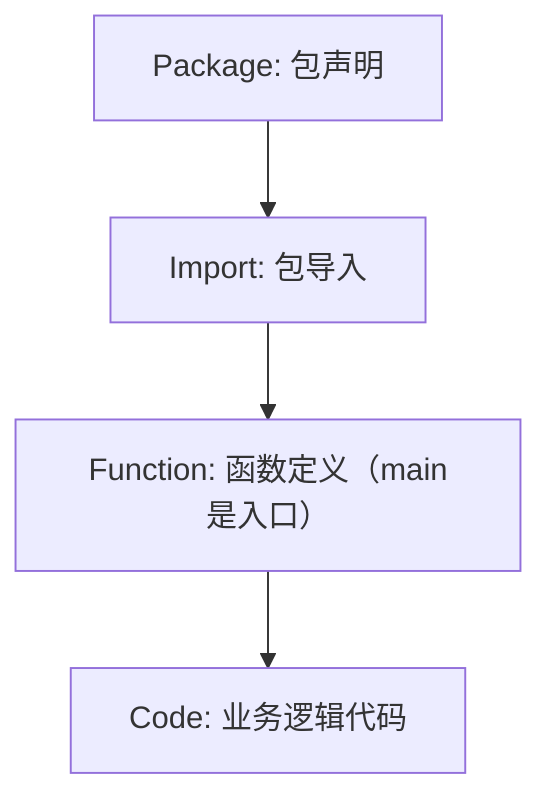

# 第2章、从环境搭建到程序运行：第一个 Go 程序之旅

大家好～ 在上一篇文章里，我们聊了为什么选择Go语言，今天就从最基础的“第一个Go程序”开始，手把手带你走完从环境搭建到代码运行、项目规范的全流程。不管你是零基础的编程新手，还是从其他语言转过来的开发者，这篇文章都能让你快速上手Go的基础开发流程。

## 1. 安装Go开发环境与版本管理

想要写Go程序，第一步当然是把开发环境搭好。这部分我们不仅讲基础安装，还会重点说版本管理——毕竟实际开发中，不同项目可能需要不同版本的Go，学会版本管理能少踩很多坑。

### 1.1 基础安装（Windows/Mac/Linux）

Go的官方安装包适配所有主流系统，步骤简单且统一：

1. **下载安装包**：

官方下载地址：[https://go.dev/dl/](https://go.dev/dl/)（推荐下载“Stable”稳定版，比如go1.22.x）

- Windows：下载`.msi`文件，双击安装，默认路径`C:\Program Files\Go\`，安装程序会自动配置环境变量。

- MacOS：下载`.pkg`文件双击安装；或用Homebrew一键安装：

  ```Bash

  brew install go
  ```

- Linux：下载`.tar.gz`文件，解压到`/usr/local`，并配置环境变量：

  ```Bash

  # 解压
  tar -C /usr/local -xzf go1.22.0.linux-amd64.tar.gz
  # 配置环境变量（写入~/.bashrc或~/.zshrc）
  export PATH=$PATH:/usr/local/go/bin
  # 生效配置
  source ~/.bashrc
  ```

1. **验证安装**：

打开终端（Windows用CMD/PowerShell，Mac/Linux用Terminal），输入：

```Bash

go version
```

若输出类似`go version go1.22.0 darwin/arm64`（Mac）或`go version go1.22.0 windows/amd64`（Windows）的信息，说明安装成功。

### 1.2 版本管理（多版本切换）

实际开发中，比如老项目依赖Go1.20，新项目要用Go1.22，这时候需要版本管理工具，推荐`gvm`（Go Version Manager）：

1. **安装gvm**（Mac/Linux）：

   ```Bash

   bash < <(curl -s -S -L https://raw.githubusercontent.com/moovweb/gvm/master/binscripts/gvm-installer)
   ```

   Windows用户可使用`gvm-windows`：[https://github.com/andrewkroh/gvm-windows](https://github.com/andrewkroh/gvm-windows)

2. **使用gvm管理版本**：

   ```Bash

   # 安装指定版本
   gvm install go1.20.0 -B
   gvm install go1.22.0 -B
   # 切换版本
   gvm use go1.20.0 --default  # 设置默认版本为1.20
   gvm use go1.22.0             # 临时切换到1.22
   ```

3. **验证版本切换**：

切换后再次执行`go version`，确认版本号已更新。

## 2. 设置GOPATH与模块模式

Go的项目管理经历了两个阶段：早期的`GOPATH`模式，和现在主流的`Go Modules`模式。我们先搞懂这两个概念，避免后续踩坑。

### 2.1 什么是GOPATH？

`GOPATH`是Go早期的工作区目录，默认路径：

- Windows：`%USERPROFILE%\go`（比如`C:\Users\你的用户名\go`）

- Mac/Linux：`$HOME/go`（比如`/Users/你的用户名/go`）

它包含三个子目录：

- `src`：存放Go项目源码

- `bin`：存放编译后的可执行文件

- `pkg`：存放编译后的包文件

### 2.2 为什么推荐模块模式（Go Modules）？

早期`GOPATH`模式有个痛点：所有项目必须放在`GOPATH/src`下，且无法为不同项目管理不同版本的依赖。Go1.11开始引入`Go Modules`（模块模式），彻底解决了这个问题——**项目可以放在任意目录**，且能精准管理依赖版本。

### 2.3 启用模块模式（无需手动配置GOPATH）

Go1.16及以上版本，`Go Modules`已默认启用，无需额外配置。若你的版本较低，可通过环境变量启用：

```Bash

# 临时启用
export GO111MODULE=on
# 永久启用（写入~/.bashrc或~/.zshrc）
echo "export GO111MODULE=on" >> ~/.bashrc
source ~/.bashrc
```

### 3. 编写并运行第一个Hello World程序

环境搭好后，我们来写第一个Go程序，体验从编码到运行的完整流程。

#### 3.1 步骤1：创建项目目录（任意位置）

不用局限于`GOPATH`，比如在桌面创建`hello-go`目录：

```Bash

# Mac/Linux
mkdir -p ~/Desktop/hello-go
cd ~/Desktop/hello-go

# Windows（PowerShell）
mkdir $HOME/Desktop/hello-go
cd $HOME/Desktop/hello-go
```

### 3.2 步骤2：编写代码

新建`main.go`文件（Go源码文件后缀为`.go`），写入以下代码：

```Go

// 声明包名，main包是可执行程序的入口包
package main

// 导入标准库的fmt包，用于输入输出
import "fmt"

// 主函数，程序的入口点，必须是main包下的main函数
func main() {
    // 输出Hello World
    fmt.Println("Hello, Go! 👋")
}
```

### 3.3 步骤3：运行程序

在终端进入`hello-go`目录，执行：

```Bash

go run main.go
```

终端会输出：`Hello, Go! 👋`，恭喜你，第一个Go程序运行成功！

## 4. 使用go run与go build构建程序

`go run`和`go build`是Go最常用的两个构建命令，我们来搞懂它们的区别和用法。

### 4.1 go run：直接运行（不生成可执行文件）

`go run`会先编译源码，然后直接运行程序，但不会生成可执行文件，适合开发调试阶段：

```Bash

# 基本用法
go run main.go

# 若有多个源码文件（比如main.go、utils.go）
go run main.go utils.go
```

### 4.2 go build：编译生成可执行文件

`go build`会将源码编译成可执行文件，适合部署发布：

1. **基本用法**：

   ```Bash

   go build main.go
   ```

   执行后，目录下会生成可执行文件：
   - Windows：`main.exe`

   - Mac/Linux：`main`

2. **运行可执行文件**：

   ```Bash

   # Windows
   .\main.exe

   # Mac/Linux
   ./main
   ```

3. **自定义可执行文件名**：

   ```Bash

   # -o 指定输出文件名
   go build -o hello main.go

   # 运行自定义名称的程序
   ./hello  # Mac/Linux
   .\hello.exe  # Windows
   ```

### 4.3 跨平台编译

Go的一大优势是跨平台编译——在一台机器上编译出其他系统的可执行文件，无需目标系统环境：

```Bash

# 示例：在Mac上编译Windows 64位程序
CGO_ENABLED=0 GOOS=windows GOARCH=amd64 go build -o hello-windows.exe main.go

# 示例：在Windows上编译Linux 64位程序（PowerShell）
$env:CGO_ENABLED=0
$env:GOOS="linux"
$env:GOARCH="amd64"
go build -o hello-linux main.go
```

参数说明：

- `CGO_ENABLED=0`：禁用CGO（避免跨平台依赖问题）

- `GOOS`：目标操作系统（windows/linux/darwin（Mac））

- `GOARCH`：目标架构（amd64/arm64/386）

## 5. 程序结构解析：包、导入、主函数

第一个程序虽然简单，但包含了Go程序的核心结构，我们逐行拆解，理解背后的逻辑。

### 5.1 包（Package）

```Go

package main
```

- Go中所有代码都属于某个“包”，包是Go的基本组织单位。

- `main`包是**特殊包**：只有`main`包才能生成可执行程序，其他包只能作为库被导入使用。

- 包名通常和目录名一致（但不是强制），比如`fmt`包对应的目录就是`fmt`。

### 5.2 导入（Import）

```Go

import "fmt"
```

- `import`用于导入其他包，使用其中的函数、变量等。

- `"fmt"`是Go标准库的包，提供格式化输入输出功能。

- 多包导入的两种写法（推荐第二种，更规范）：

  ```Go

  // 写法1：多行导入
  import "fmt"
  import "os"

  // 写法2：分组导入（推荐）
  import (
      "fmt"
      "os"
  )
  ```

### 5.3 主函数（main函数）

```Go

func main() {
    fmt.Println("Hello, Go! 👋")
}
```

- `main()`函数是程序的**唯一入口**，必须定义在`main`包下，且没有参数、没有返回值。

- `fmt.Println()`是`fmt`包的函数，用于输出一行文本到控制台。

- 函数体必须用`{}`包裹，且`{`必须和函数名在同一行（Go的语法规范）。

### 5.4 完整结构总结



## 6. 注释与代码可读性规范

好的注释和代码规范能让你的代码更易读、易维护，Go有明确的注释规范，我们来学习。

### 6.1 Go的注释方式

Go支持两种注释：单行注释和多行注释，**多行注释仅用于包注释**，单行注释用于代码内注释。

```Go

// 单行注释：这是main包，程序入口包
package main

/*
多行注释（包注释专用）：
fmt包提供格式化输入输出功能，
是Go标准库的核心包之一。
*/
import "fmt"

// main函数：程序的入口点
func main() {
    // 输出Hello World
    // fmt.Println是打印函数，会自动换行
    fmt.Println("Hello, Go! 👋")
}
```

### 6.2 代码可读性规范（Go官方推荐）

1. **包注释**：每个包都要有多行注释，说明包的功能（放在`package`声明上方）。

2. **函数注释**：对外暴露的函数（首字母大写）必须加单行注释，说明功能、参数、返回值。

3. **命名规范**：
   - 包名：小写、简洁，无下划线（比如`fmt`、`net/http`）。

   - 变量/函数名：驼峰命名，对外暴露的首字母大写（`UserName`），内部使用的首字母小写（`userName`）。

   - 常量名：全大写，下划线分隔（`MAX_SIZE`）。

4. **代码格式**：
   - 使用`go fmt`命令自动格式化代码（VS Code/Goland会自动执行），保证代码风格统一。

   - 每行代码不超过80个字符，过长时换行。

示例：规范的代码注释

```Go

// 包注释：hello包提供简单的问候功能
package hello

import "fmt"

// Greet 向指定用户发送问候语
// 参数：name - 用户名
// 返回值：拼接好的问候字符串
func Greet(name string) string {
    // 拼接字符串，使用fmt.Sprintf格式化
    return fmt.Sprintf("Hello, %s!", name)
}

// 内部函数，首字母小写，无需对外注释
func printGreet(name string) {
    fmt.Println(Greet(name))
}
```

## 7. 使用Go Modules初始化项目

前面我们提到`Go Modules`是现在的主流项目管理方式，接下来学习如何用它初始化项目、管理依赖。

### 7.1 初始化模块

进入你的项目目录（比如`hello-go`），执行：

```Bash

go mod init github.com/你的用户名/hello-go
```

- `github.com/你的用户名/hello-go`是**模块路径**（可以是任意字符串，推荐用GitHub仓库地址，方便后续发布）。

- 执行后会生成`go.mod`文件，这是模块的核心配置文件，记录模块路径和Go版本：

  ```Plain Text

  module github.com/你的用户名/hello-go

  go 1.22
  ```

### 7.2 添加依赖

比如我们要使用第三方库`github.com/gin-gonic/gin`（高性能Web框架），直接在代码中导入，然后执行`go mod tidy`即可自动下载依赖：

1. 修改`main.go`：

   ```Go

   package main

   import (
       "fmt"
       "github.com/gin-gonic/gin"
   )

   func main() {
       fmt.Println("Hello, Go! 👋")
       // 初始化gin引擎
       r := gin.Default()
       r.GET("/", func(c *gin.Context) {
           c.JSON(200, gin.H{
               "message": "Hello, Go!",
           })
       })
       r.Run(":8080") // 启动服务
   }
   ```

2. 执行`go mod tidy`：

   ```Bash

   go mod tidy
   ```

   该命令会自动分析代码中的依赖，下载缺失的依赖，并删除无用的依赖。执行后会生成`go.sum`文件（记录依赖的哈希值，保证依赖完整性），`go.mod`会新增依赖记录：

   ```Plain Text

   module github.com/你的用户名/hello-go

   go 1.22

   require github.com/gin-gonic/gin v1.9.1

   require (
       // 省略gin的依赖...
   )
   ```

### 7.3 常用Go Modules命令

```Bash

go mod init  # 初始化模块
go mod tidy  # 整理依赖
go mod download  # 下载依赖到本地缓存
go mod vendor  # 将依赖复制到项目的vendor目录
go mod verify  # 验证依赖的完整性
```

## 8. 常见错误与调试入门

新手写Go程序时，容易遇到一些常见错误，我们来总结并给出解决方法，同时入门基础调试技巧。

### 8.1 常见错误及解决

1. **错误1：包名不是main，但想生成可执行程序**

   ```Go

   // 错误代码
   package hello  // 不是main包

   func main() {
       fmt.Println("Hello")
   }
   ```

   报错：`runtime.main_main·f: function main is undeclared in the main package`

   解决：将包名改为`main`。

2. **错误2：import导入了未使用的包**

   ```Go

   package main

   import (
       "fmt"
       "os"  // 导入但未使用
   )

   func main() {
       fmt.Println("Hello")
   }
   ```

   报错：`imported and not used: "os"`

   解决：删除未使用的包导入，或使用`_`忽略（`import _ "os"`）。

3. **错误3：函数名大小写错误（对外暴露的函数首字母小写）**

   ```Go

   package hello

   // 首字母小写，其他包无法导入
   func greet() string {
       return "Hello"
   }
   ```

   解决：对外暴露的函数首字母大写（`Greet`）。

4. **错误4：go build跨平台编译时CGO未禁用**

报错：`cannot load C:\Program Files\Go\pkg\windows_amd64\runtime/cgo: open ...: permission denied`

解决：编译时加`CGO_ENABLED=0`（见4.3节）。

### 8.2 调试入门（使用VS Code）

1. **配置调试环境**：
   - 在VS Code中打开项目，点击左侧“运行和调试”（Ctrl+Shift+D）。

   - 点击“创建launch.json文件”，选择“Go”，自动生成调试配置。

2. **设置断点**：

在代码行号左侧点击，出现红色圆点即为断点（比如`fmt.Println`那一行）。

1. **启动调试**：

点击“启动调试”（F5），程序会停在断点处，可查看变量、单步执行（F10）、继续执行（F5）。

### 8.3 基础调试命令（终端）

若没有IDE，可使用`go run`结合打印语句调试，或使用`dlv`（Delve，Go官方调试工具）：

```Bash

# 安装dlv
go install github.com/go-delve/delve/cmd/dlv@latest

# 启动调试
dlv debug main.go

# 调试命令
(dlv) break main.go:10  # 在第10行设置断点
(dlv) run               # 运行程序
(dlv) next              # 单步执行
(dlv) print name        # 打印变量name的值
(dlv) continue          # 继续执行
(dlv) exit              # 退出调试
```

## 总结

1. **环境搭建**：优先使用官方安装包，多版本管理用`gvm`，无需纠结`GOPATH`，Go1.16+默认启用模块模式。

2. **程序核心结构**：`main`包+`main`函数是可执行程序的入口，`import`导入依赖包，代码需遵循Go的命名和注释规范。

3. **项目管理**：用`go mod init`初始化模块，`go mod tidy`管理依赖，`go run`调试、`go build`编译部署。

4. **避坑与调试**：常见错误多是包名、导入、命名规范问题，调试优先用VS Code断点调试，终端可用`dlv`工具。

到这里，你已经掌握了Go程序的基础开发流程，接下来可以尝试写一些简单的小程序（比如计算器、文件读写），巩固今天的知识点。如果有任何问题，欢迎在评论区交流～
