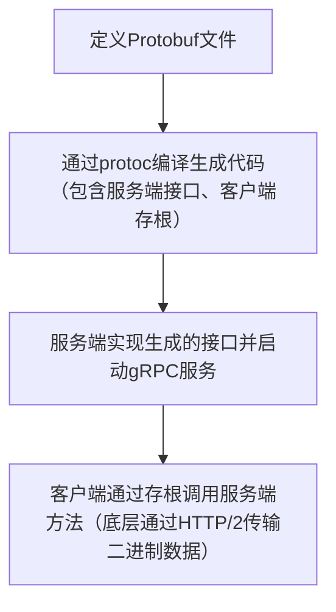

# 第21章：微服务与分布式架构中的Go应用

随着业务规模扩大，单体应用会逐渐面临“牵一发而动全身”的困境——部署繁琐、扩容困难、技术栈锁定。微服务架构通过将单体应用拆分为多个独立、可复用的服务，解决了这一痛点，而Go语言凭借其**高并发、轻量级、编译快速**的特性，成为微服务开发的首选语言之一。

本章将聚焦微服务与分布式架构的核心组件，结合Go语言实操，从gRPC通信、Protobuf序列化，到服务发现、配置中心、链路追踪、消息队列，一步步拆解Go在分布式场景中的落地方式，所有代码示例精简可运行，关键工具标注官方引用，兼顾理论与实战，适配掘金读者“拿来就用”的需求。

先明确一个核心认知：微服务的核心是“拆分”与“协同”——拆分单体为独立服务，通过标准化组件实现服务间协同（通信、配置、追踪等），而Go的设计哲学（简洁、高效、原生支持并发），恰好契合微服务对性能和可维护性的要求。

## 1. gRPC基础

在微服务架构中，服务间通信是基础。常见的通信方式分为两类：RESTful API（HTTP/1.1，JSON格式，适合跨语言、跨终端）和RPC（远程过程调用，二进制格式，适合服务间高频通信、追求高性能）。

gRPC是Google开源的高性能RPC框架，基于HTTP/2协议，采用Protobuf作为序列化格式，支持跨语言、双向流、熔断、超时控制等特性，是Go微服务中服务间通信的主流选择——比RESTful API性能更高（二进制序列化比JSON更紧凑、解析更快），比原生RPC更具通用性。

### 1.1 gRPC核心优势

- 高性能：基于HTTP/2（多路复用、头部压缩），Protobuf二进制序列化，比JSON+HTTP/1.1快30%-50%；

- 跨语言：支持Go、Java、Python、JavaSciprt等主流语言，服务可混用不同语言开发；

- 强类型：通过Protobuf定义服务和数据结构，编译期校验，避免类型错误；

- 原生支持流通信：单向流、双向流，适配大数据传输、实时推送等场景；

- 可扩展：内置熔断、超时、重试、负载均衡等机制，适配分布式场景。

### 1.2 gRPC通信流程（图例）

gRPC的通信流程简洁清晰，核心分为4步，用流程图直观展示：



### 1.3 Go环境安装gRPC依赖

在Go项目中使用gRPC，需先安装核心依赖和编译工具，执行以下命令：

```bash
// 1. 安装gRPC核心库
go get google.golang.org/grpc@latest

// 2. 安装Protobuf编译工具protoc（需根据系统下载，以Linux为例）
// 官方下载地址：https://github.com/protocolbuffers/protobuf/releases
// 解压后将protoc二进制文件放入/usr/local/bin/

// 3. 安装Go语言的protoc插件（用于编译Protobuf生成Go代码）
go install google.golang.org/protobuf/cmd/protoc-gen-go@latest
go install google.golang.org/grpc/cmd/protoc-gen-go-grpc@latest

// 4. 配置环境变量（确保protoc-gen-go和protoc-gen-go-grpc可被找到）
export PATH="$PATH:$(go env GOPATH)/bin"

```

gRPC官方文档（Go版）：[https://grpc.io/docs/languages/go/quickstart/](https://grpc.io/docs/languages/go/quickstart/)

## 2. Protobuf

Protobuf（Protocol Buffers）是Google开源的**二进制序列化协议**，用于定义服务接口和数据结构，是gRPC的核心依赖。不同于JSON（文本格式，易读但冗余、解析慢），Protobuf是二进制格式，体积小、解析快，且支持强类型定义，编译期校验，适合高性能、跨语言的数据传输。

核心特点：语言无关、平台无关、可扩展，一旦定义，可生成多种语言的代码，无需手动编写序列化/反序列化逻辑。

### 2.1 Protobuf基础语法（v3）

Protobuf文件后缀为`.proto`，语法简洁，核心包含「语法声明、包名、消息定义、服务定义」4部分，以下是最简示例：

```proto
// 1. 声明语法版本（v3是主流，不指定默认v2）
syntax = "proto3";

// 2. 声明包名（用于区分不同Protobuf文件，避免命名冲突）
package user;

// 3. 定义消息（Message）：对应Go中的结构体，用于数据传输
// 格式：message 消息名 { 类型 字段名 = 字段编号; }
// 字段编号：1-15占用1字节，16-2047占用2字节，建议常用字段用1-15
message UserRequest {
  string user_id = 1; // 用户ID
  string name = 2;    // 用户名
  int32 age = 3;      // 年龄
}

message UserResponse {
  bool success = 1;   // 调用是否成功
  string msg = 2;     // 提示信息
  UserRequest data = 3; // 响应数据（可嵌套消息）
}

// 4. 定义服务（Service）：对应gRPC的服务接口
service UserService {
  // 定义RPC方法：请求为UserRequest，响应为UserResponse
  rpc GetUser(UserRequest) returns (UserResponse);
}

```

### 2.2 常用类型映射（Go ↔ Protobuf）

Protobuf的类型与Go语言类型有明确映射关系，无需手动转换，编译后自动生成对应代码，核心映射如下（常用）：

| Protobuf类型   | Go语言类型 | 说明                             |
| -------------- | ---------- | -------------------------------- |
| string         | string     | 字符串类型                       |
| int32          | int32      | 32位整数（适合小范围整数）       |
| int64          | int64      | 64位整数（适合大范围整数，如ID） |
| bool           | bool       | 布尔类型                         |
| float32        | float32    | 32位浮点数                       |
| message 消息名 | \*消息名   | 嵌套消息（对应Go的指针结构体）   |

### 2.3 编译Protobuf生成Go代码

编写完`.proto`文件后，需通过`protoc`编译，生成Go语言的服务端接口、客户端存根和消息结构体，执行以下命令（假设Protobuf文件名为`user.proto`，放在`proto/user`目录下）：

```bash
# 进入项目根目录，执行编译命令
protoc --go_out=. --go_opt=paths=source_relative \
  --go-grpc_out=. --go-grpc_opt=paths=source_relative \
  proto/user/user.proto

```

命令说明：

- `--go_out=.`：生成消息结构体（Protobuf核心代码），输出到当前目录；

- `--go-grpc_out=.`：生成gRPC服务端接口和客户端存根，输出到当前目录；

- `--go_opt=paths=source_relative`：按Protobuf文件的相对路径生成代码（避免路径混乱）。

编译成功后，会在`proto/user`目录下生成两个文件：

- `user.pb.go`：消息结构体和序列化/反序列化方法；

- `user_grpc.pb.go`：gRPC服务端接口（`UserServiceServer`）和客户端存根（`UserServiceClient`）。

Protobuf官方文档：[https://protobuf.dev/](https://protobuf.dev/)

## 3. 服务定义（gRPC服务端实现）

通过Protobuf编译生成代码后，下一步就是**实现服务端接口**——Go语言中，需定义一个结构体，实现`user_grpc.pb.go`中生成的`UserServiceServer`接口（即实现Protobuf中定义的RPC方法），然后启动gRPC服务，监听端口，等待客户端调用。

核心步骤：实现接口 → 创建gRPC服务 → 注册服务 → 启动监听。

### 3.1 服务端完整示例（简洁可运行）

假设已完成Protobuf编译（参考2.3节），服务端代码如下（`server/main.go`）：

```go
package main

import (
	"context"
	"log"
	"net"

	// 导入编译生成的gRPC代码（路径根据自己的项目调整）
	pb "your-project-path/proto/user"
	"google.golang.org/grpc"
)

// 1. 定义结构体，实现UserServiceServer接口
type userServer struct {
	pb.UnimplementedUserServiceServer // 必须嵌入，兼容未来接口扩展
}

// 2. 实现Protobuf中定义的RPC方法：GetUser
// 方法签名必须和生成的接口一致（参数、返回值、方法名）
func (s *userServer) GetUser(ctx context.Context, req *pb.UserRequest) (*pb.UserResponse, error) {
	// 模拟业务逻辑：根据user_id查询用户（实际场景可查数据库）
	log.Printf("收到客户端请求：user_id=%s, name=%s", req.UserId, req.Name)

	// 构造响应数据
	return &pb.UserResponse{
		Success: true,
		Msg:     "查询成功",
		Data: &pb.UserRequest{
			UserId: req.UserId,
			Name:   req.Name,
			Age:    req.Age,
		},
	}, nil
}

func main() {
	// 3. 监听端口（gRPC默认使用TCP协议）
	listen, err := net.Listen("tcp", ":50051")
	if err != nil {
		log.Fatalf("监听失败：%v", err)
	}
	log.Printf("gRPC服务启动，监听端口：50051")

	// 4. 创建gRPC服务实例（可添加拦截器，后续链路追踪会用到）
	s := grpc.NewServer()

	// 5. 注册服务（将实现的userServer注册到gRPC服务中）
	pb.RegisterUserServiceServer(s, &userServer{})

	// 6. 启动服务，开始接收客户端请求（阻塞式）
	if err := s.Serve(listen); err != nil {
		log.Fatalf("服务启动失败：%v", err)
	}
}

```

### 3.2 关键说明

- 嵌入`pb.UnimplementedUserServiceServer`：Protobuf v3中，若接口后续新增方法，未实现的方法会默认返回“未实现”错误，嵌入该结构体可避免服务启动失败，保证兼容性；

- Context参数：用于传递超时、取消信号、元数据（如Token），是Go微服务中传递上下文的标准方式；

- 端口选择：gRPC无默认端口，推荐使用50051（官方示例端口），实际生产环境可自定义；

- 服务注册：通过`pb.RegisterUserServiceServer`将结构体注册到gRPC服务，这样客户端才能找到对应的服务方法。

### 3.3 启动服务端

进入`server`目录，执行以下命令启动服务：

```bash
go run main.go

```

启动成功后，控制台会输出：`gRPC服务启动，监听端口：50051`，此时服务端已准备就绪，等待客户端调用。

## 4. 客户端（gRPC客户端调用）

gRPC客户端的核心是“通过存根（Stub）调用服务端方法”——编译Protobuf生成的`user_grpc.pb.go`中，已包含`UserServiceClient`客户端存根，客户端只需创建gRPC连接，通过存根调用对应的RPC方法，即可与服务端通信。

核心步骤：创建gRPC连接 → 生成客户端存根 → 调用RPC方法 → 处理响应。

### 4.1 客户端完整示例（简洁可运行）

客户端代码如下（`client/main.go`），与服务端对应：

```go
package main

import (
	"context"
	"log"
	"time"

	// 导入编译生成的gRPC代码（路径与服务端一致）
	pb "your-project-path/proto/user"
	"google.golang.org/grpc"
	"google.golang.org/grpc/credentials/insecure" // 无加密连接（开发环境用）
)

func main() {
	// 1. 创建gRPC连接（开发环境用无加密连接，生产环境需配置TLS）
	// 服务端地址：ip:port（与服务端监听的地址一致）
	conn, err := grpc.Dial(
		"localhost:50051",
		grpc.WithTransportCredentials(insecure.NewCredentials()), // 无加密
		grpc.WithBlock(), // 阻塞等待连接建立成功
	)
	if err != nil {
		log.Fatalf("连接服务端失败：%v", err)
	}
	defer conn.Close() // 程序退出时关闭连接

	// 2. 生成客户端存根（Stub）
	client := pb.NewUserServiceClient(conn)

	// 3. 创建上下文（设置超时时间，避免无限阻塞）
	ctx, cancel := context.WithTimeout(context.Background(), 3*time.Second)
	defer cancel() // 函数退出时取消上下文

	// 4. 调用RPC方法（GetUser），传递请求参数
	req := &pb.UserRequest{
		UserId: "1001",
		Name:   "Alice",
		Age:    20,
	}
	res, err := client.GetUser(ctx, req)
	if err != nil {
		log.Fatalf("调用GetUser失败：%v", err)
	}

	// 5. 处理响应结果
	log.Printf("服务端响应：success=%v, msg=%s", res.Success, res.Msg)
	log.Printf("用户信息：user_id=%s, name=%s, age=%d", res.Data.UserId, res.Data.Name, res.Data.Age)
}

```

### 4.2 关键说明

- 无加密连接：`insecure.NewCredentials()`用于开发环境，生产环境需配置TLS加密（避免数据泄露），参考gRPC官方TLS配置文档；

- 上下文超时：`context.WithTimeout`设置请求超时时间（如3秒），防止服务端无响应导致客户端阻塞；

- 连接关闭：`defer conn.Close()`确保程序退出时关闭gRPC连接，避免资源泄露；

- 方法调用：客户端存根的方法签名与服务端接口一致，调用时直接传递请求参数，返回响应和错误，无需关心底层通信细节。

### 4.3 运行客户端，测试通信

1. 确保服务端已启动（参考3.3节）；

2. 进入`client`目录，执行以下命令启动客户端：

```bash
go run main.go

```

3. 客户端控制台输出（成功响应）：

```bash
服务端响应：success=true, msg=查询成功
用户信息：user_id=1001, name=Alice, age=20

```

4. 服务端控制台输出（收到请求）：

```bash
收到客户端请求：user_id=1001, name=Alice

```

至此，一个简单的gRPC服务端+客户端通信就完成了，这是Go微服务间通信的基础。

## 5. 服务发现

在微服务架构中，服务不是固定的——服务会扩容、缩容、重启，IP和端口会动态变化。如果客户端硬编码服务端的IP:Port，一旦服务端地址变化，客户端就会调用失败，这就是“服务发现”要解决的问题。

服务发现的核心：**服务端启动时，将自己的地址（IP:Port）注册到服务注册中心；客户端调用服务时，先从注册中心查询服务端的可用地址，再发起调用**，无需硬编码地址。

### 5.1 常用服务发现组件

Go微服务中，常用的服务发现组件有3种，各有适配场景：

- **etcd**：分布式键值存储，支持服务注册、发现、配置管理，一致性强，适合大规模分布式架构（推荐生产环境）；

- **Consul**：支持服务发现、配置中心、健康检查，功能全面，部署简单，适合中小规模架构；

- **ZooKeeper**：老牌分布式协调工具，支持服务发现，但Go生态对其支持不如etcd，现在较少用。

本章以**etcd**为例（Go生态原生支持，与K8s适配性好），实现服务注册与发现。

### 5.2 etcd安装与基础使用

第一步：安装etcd（开发环境，以Docker为例，最简单）：

```bash
# 拉取etcd镜像
docker pull bitnami/etcd:latest

# 启动etcd容器（开发环境，关闭认证）
docker run -d \
  --name etcd \
  -p 2379:2379 \
  -p 2380:2380 \
  bitnami/etcd:latest \
  --listen-client-urls http://0.0.0.0:2379 \
  --advertise-client-urls http://localhost:2379 \
  --listen-peer-urls http://0.0.0.0:2380 \
  --initial-advertise-peer-urls http://localhost:2380 \
  --initial-cluster-token etcd-cluster-token \
  --initial-cluster localhost=http://localhost:2380 \
  --initial-cluster-state new \
  --allow-none-authentication

```

第二步：安装etcd Go客户端（项目中使用）：

```bash
go get go.etcd.io/etcd/client/v3@latest

```

etcd官方文档：[https://etcd.io/docs/latest/](https://etcd.io/docs/latest/)

### 5.3 服务注册与发现（Go实操示例）

核心实现：服务端启动时，将自己的地址注册到etcd（键为服务名，值为IP:Port）；客户端调用前，从etcd查询服务名对应的地址，再发起gRPC调用。

#### 5.3.1 服务端注册（改造3.1节服务端代码）

```go
package main

import (
	"context"
	"log"
	"net"
	"time"

	pb "your-project-path/proto/user"
	"go.etcd.io/etcd/client/v3"
	"google.golang.org/grpc"
)

// 服务名（统一标识，客户端通过该名称查询）
const serviceName = "user-service"
// etcd地址
const etcdAddr = "localhost:2379"

type userServer struct {
	pb.UnimplementedUserServiceServer
}

func (s *userServer) GetUser(ctx context.Context, req *pb.UserRequest) (*pb.UserResponse, error) {
	log.Printf("收到客户端请求：user_id=%s, name=%s", req.UserId, req.Name)
	return &pb.UserResponse{
		Success: true,
		Msg:     "查询成功",
		Data:    req,
	}, nil
}

// 服务注册：将服务地址注册到etcd
func registerService() error {
	// 1. 连接etcd
	client, err := clientv3.New(clientv3.Config{
		Endpoints:   []string{etcdAddr},
		DialTimeout: 5 * time.Second,
	})
	if err != nil {
		return err
	}
	defer client.Close()

	// 2. 服务地址（与服务端监听地址一致）
	serviceAddr := "localhost:50051"
	// 3. etcd的key：/service/{serviceName}/{serviceAddr}（便于后续删除、查询）
	key := "/service/" + serviceName + "/" + serviceAddr
	// 4. 注册服务（设置TTL=10秒，定期续租，避免服务下线后仍被查询）
	leaseResp, err := client.Grant(context.Background(), 10)
	if err != nil {
		return err
	}
	// 5. 写入etcd（key-value）
	_, err = client.Put(context.Background(), key, serviceAddr, clientv3.WithLease(leaseResp.ID))
	if err != nil {
		return err
	}
	// 6. 续租：定期刷新TTL，确保服务在线时，注册信息不失效
	ch, err := client.KeepAlive(context.Background(), leaseResp.ID)
	if err != nil {
		return err
	}
	// 7. 监听续租响应（打印续租日志，异常时退出）
	go func() {
		for range ch {
			log.Printf("服务注册续租成功，服务地址：%s", serviceAddr)
		}
		log.Fatalf("服务续租失败，服务地址：%s", serviceAddr)
	}()

	log.Printf("服务注册成功，服务名：%s，地址：%s", serviceName, serviceAddr)
	return nil
}

func main() {
	// 1. 先注册服务到etcd
	if err := registerService(); err != nil {
		log.Fatalf("服务注册失败：%v", err)
	}

	// 2. 启动gRPC服务（与之前一致）
	listen, err := net.Listen("tcp", ":50051")
	if err != nil {
		log.Fatalf("监听失败：%v", err)
	}
	s := grpc.NewServer()
	pb.RegisterUserServiceServer(s, &userServer{})
	log.Printf("gRPC服务启动，监听端口：50051")
	if err := s.Serve(listen); err != nil {
		log.Fatalf("服务启动失败：%v", err)
	}
}

```

#### 5.3.2 客户端发现（改造4.1节客户端代码）

```go
package main

import (
	"context"
	"log"
	"strings"
	"time"

	pb "your-project-path/proto/user"
	"go.etcd.io/etcd/client/v3"
	"google.golang.org/grpc"
	"google.golang.org/grpc/credentials/insecure"
)

const serviceName = "user-service"
const etcdAddr = "localhost:2379"

// 服务发现：从etcd查询服务端地址
func discoverService() (string, error) {
	// 1. 连接etcd
	client, err := clientv3.New(clientv3.Config{
		Endpoints:   []string{etcdAddr},
		DialTimeout: 5 * time.Second,
	})
	if err != nil {
		return "", err
	}
	defer client.Close()

	// 2. 查询etcd：前缀匹配（所有user-service的服务地址）
	keyPrefix := "/service/" + serviceName + "/"
	resp, err := client.Get(context.Background(), keyPrefix, clientv3.WithPrefix())
	if err != nil {
		return "", err
	}
	// 3. 提取服务地址（简化版：取第一个可用地址，生产环境可做负载均衡）
	if len(resp.Kvs) == 0 {
		return "", log.Fatalf("未查询到%s服务", serviceName)
	}
	// 4. 解析key，获取服务地址（key格式：/service/user-service/localhost:50051）
	key := string(resp.Kvs[0].Key)
	serviceAddr := strings.TrimPrefix(key, keyPrefix)
	log.Printf("查询到服务地址：%s", serviceAddr)
	return serviceAddr, nil
}

func main() {
	// 1. 服务发现：从etcd查询服务端地址
	serviceAddr, err := discoverService()
	if err != nil {
		log.Fatalf("服务发现失败：%v", err)
	}

	// 2. 连接gRPC服务（使用查询到的地址，无需硬编码）
	conn, err := grpc.Dial(
		serviceAddr,
		grpc.WithTransportCredentials(insecure.NewCredentials()),
		grpc.WithBlock(),
	)
	if err != nil {
		log.Fatalf("连接服务端失败：%v", err)
	}
	defer conn.Close()

	// 3. 调用RPC方法（与之前一致）
	client := pb.NewUserServiceClient(conn)
	ctx, cancel := context.WithTimeout(context.Background(), 3*time.Second)
	defer cancel()
	req := &pb.UserRequest{UserId: "1001", Name: "Alice", Age: 20}
	res, err := client.GetUser(ctx, req)
	if err != nil {
		log.Fatalf("调用失败：%v", err)
	}
	log.Printf("服务端响应：%+v", res)
}

```

### 5.4 服务发现关键要点

- 服务注册：需设置TTL（生存时间），并定期续租，避免服务下线后（如崩溃），注册信息仍在etcd中，导致客户端调用失败；

- 服务发现：客户端查询时，可通过前缀匹配获取所有可用服务地址，再实现简单负载均衡（如轮询、随机），提升可用性；

- 生产环境：可使用`etcd/client/v3`的Watcher功能，监听服务地址变化，实时更新客户端的服务地址列表，无需每次调用都查询etcd。

## 6. 配置中心

微服务架构中，服务数量多，配置分散（如数据库地址、端口、超时时间、第三方接口密钥等），如果每个服务的配置都写在代码中，修改配置时需要重新编译、部署服务，效率极低，且容易出错——配置中心就是为了解决“配置集中管理、动态更新”的问题。

配置中心的核心：**将所有服务的配置集中存储，服务启动时从配置中心拉取配置，配置更新时，服务实时感知并应用新配置，无需重启服务**。

### 6.1 常用配置中心组件

与服务发现组件类似，Go微服务中常用的配置中心有3种：

- **etcd**：分布式键值存储，可同时作为服务发现和配置中心，轻量级、一致性强，适合Go生态；

- **Nacos**：阿里开源，专门的配置中心+服务发现组件，功能全面，支持动态配置、灰度发布，易用性高；

- **Apollo**：携程开源，功能强大，支持多环境、多集群配置管理，适合大规模企业级架构。

本章仍以**etcd**为例（复用服务发现的etcd，减少组件依赖），实现配置中心的核心功能：配置存储、配置拉取、动态更新。

### 6.2 配置中心Go实操示例

核心场景：将gRPC服务的监听端口、超时时间等配置，存储在etcd中；服务启动时拉取配置，配置更新时，服务实时更新端口（简化示例，生产环境需谨慎处理端口更新）。

#### 6.2.1 向etcd写入配置（手动/脚本）

先向etcd写入服务配置（key为配置路径，value为JSON格式的配置），可通过etcd客户端命令行或代码写入，这里用命令行示例：

```bash
# 进入etcd容器
docker exec -it etcd /bin/sh

# 写入配置（key：/config/user-service，value：JSON配置）
etcdctl put /config/user-service '{"grpc_port": "50051", "timeout": 3, "log_level": "info"}'

# 查看配置
etcdctl get /config/user-service

```

#### 6.2.2 服务拉取配置并监听动态更新

```go
package main

import (
	"context"
	"encoding/json"
	"log"
	"net"
	"time"

	pb "your-project-path/proto/user"
	"go.etcd.io/etcd/client/v3"
	"google.golang.org/grpc"
)

// 配置结构体（与etcd中的JSON配置对应）
type ServiceConfig struct {
	GrpcPort string `json:"grpc_port"` // gRPC监听端口
	Timeout  int    `json:"timeout"`   // 超时时间（秒）
	LogLevel string `json:"log_level"` // 日志级别
}

const configKey = "/config/user-service" // etcd配置key
const etcdAddr = "localhost:2379"

type userServer struct {
	pb.UnimplementedUserServiceServer
}

func (s *userServer) GetUser(ctx context.Context, req *pb.UserRequest) (*pb.UserResponse, error) {
	log.Printf("收到客户端请求：user_id=%s", req.UserId)
	return &pb.UserResponse{Success: true, Msg: "查询成功", Data: req}, nil
}

// 拉取配置：从etcd获取配置并反序列化
func pullConfig() (ServiceConfig, error) {
	client, err := clientv3.New(clientv3.Config{
		Endpoints:   []string{etcdAddr},
		DialTimeout: 5 * time.Second,
	})
	if err != nil {
		return ServiceConfig{}, err
	}
	defer client.Close()

	// 查询etcd配置
	resp, err := client.Get(context.Background(), configKey)
	if err != nil {
		return ServiceConfig{}, err
	}
	if len(resp.Kvs) == 0 {
		log.Fatalf("未查询到配置：%s", configKey)
	}

	// JSON反序列化为配置结构体
	var config ServiceConfig
	err = json.Unmarshal(resp.Kvs[0].Value, &config)
	if err != nil {
		return ServiceConfig{}, err
	}
	log.Printf("拉取配置成功：%+v", config)
	return config, nil
}

// 监听配置更新：实时感知etcd中的配置变化
func watchConfig(onUpdate func(ServiceConfig)) {
	client, err := clientv3.New(clientv3.Config{
		Endpoints:   []string{etcdAddr},
		DialTimeout: 5 * time.Second,
	})
	if err != nil {
		log.Fatalf("连接etcd失败：%v", err)
	}
	defer client.Close()

	// 监听配置key的变化（创建Watcher）
	watchChan := client.Watch(context.Background(), configKey)
	log.Println("开始监听配置更新...")

	// 循环监听
	for watchResp := range watchChan {
		for _, event := range watchResp.Events {
			// 配置更新/新增（忽略删除事件）
			if event.Type == clientv3.EventTypePut {
				var newConfig ServiceConfig
				err := json.Unmarshal(event.Kv.Value, &newConfig)
				if err != nil {
					log.Printf("配置解析失败：%v", err)
					continue
				}
				log.Printf("配置更新：%+v", newConfig)
				// 调用回调函数，处理配置更新（如重启服务、更新全局配置）
				onUpdate(newConfig)
			}
		}
	}
}

func main() {
	// 1. 拉取初始配置
	config, err := pullConfig()
	if err != nil {
		log.Fatalf("拉取配置失败：%v", err)
	}

	// 2. 启动配置监听（异步，不阻塞主流程）
	go watchConfig(func(newConfig ServiceConfig) {
		// 回调函数：配置更新时执行（简化示例，仅打印日志，生产环境可重启服务）
		log.Printf("配置已更新，新配置：%+v", newConfig)
		// 注意：生产环境中，端口更新需谨慎，建议通过服务发现实现平滑切换
	})

	// 3. 启动gRPC服务（使用拉取的配置端口）
	listen, err := net.Listen("tcp", ":"+config.GrpcPort)
	if err != nil {
		log.Fatalf("监听失败：%v", err)
	}
	s := grpc.NewServer()
	pb.RegisterUserServiceServer(s, &userServer{})
	log.Printf("gRPC服务启动，监听端口：%s", config.GrpcPort)
	if err := s.Serve(listen); err != nil {
		log.Fatalf("服务启动失败：%v", err)
	}
}

```

### 6.3 配置中心关键要点

- 配置格式：推荐使用JSON/YAML，结构清晰，易解析，适合存储复杂配置；

- 动态更新：通过etcd的Watcher功能，监听配置变化，回调函数处理更新逻辑（如重启服务、更新全局变量），生产环境需避免直接重启服务，可通过服务发现实现平滑切换；

- 配置加密：敏感配置（如数据库密码、密钥）需加密存储（如AES加密），服务拉取后解密，避免明文泄露；

- 多环境配置：可通过etcd的key前缀区分环境（如`/config/dev/user-service`、`/config/prod/user-service`），服务启动时指定环境，拉取对应配置。

## 7. 链路追踪

在分布式微服务架构中，一个请求可能会经过多个服务（如用户请求 → 网关服务 → 用户服务 → 订单服务 → 数据库），如果某个环节出现延迟、错误，很难定位问题所在——链路追踪就是为了解决“分布式请求追踪、问题定位”的问题。

链路追踪的核心：**为每个请求分配一个唯一的Trace ID（链路ID），每个服务调用分配一个Span ID（跨度ID），记录请求在每个服务中的耗时、状态、上下文信息，最终将所有Span串联起来，形成完整的请求链路，便于排查问题**。

### 7.1 常用链路追踪组件

Go微服务中，常用的链路追踪组件是**Jaeger**（Uber开源，兼容OpenTelemetry规范，易用性高）和**Zipkin**（Twitter开源，轻量级），本章以Jaeger为例，实现Go微服务的链路追踪。

### 7.2 Jaeger安装与基础配置

第一步：用Docker启动Jaeger（开发环境，最简单）：

```bash
# 启动Jaeger容器（包含Collector、Query、Agent）
docker run -d \
  --name jaeger \
  -e COLLECTOR_ZIPKIN_HOST_PORT=:9411 \
  -p 5775:5775/udp \
  -p 6831:6831/udp \
  -p 6832:6832/udp \
  -p 5778:5778 \
  -p 16686:16686 \
  -p 14268:14268 \
  -p 14250:14250 \
  -p 9411:9411 \
  jaegertracing/all-in-one:latest

```

第二步：访问Jaeger UI（查看链路追踪结果）：

打开浏览器，访问`http://localhost:16686`，即可看到Jaeger的管理界面，默认无数据，待服务调用后会显示链路信息。

第三步：安装Go链路追踪依赖（OpenTelemetry + Jaeger）：

```bash
# OpenTelemetry核心依赖（链路追踪规范）
go get go.opentelemetry.io/otel@latest
# Jaeger exporter（将链路数据导出到Jaeger）
go get go.opentelemetry.io/otel/exporters/jaeger@latest
# gRPC拦截器（自动注入Trace ID、Span ID）
go get go.opentelemetry.io/contrib/instrumentation/google.golang.org/grpc/otelgrpc@latest

```

Jaeger官方文档：[https://www.jaegertracing.io/docs/latest/](https://www.jaegertracing.io/docs/latest/)

### 7.3 Go微服务链路追踪实操（改造gRPC服务）

核心实现：在gRPC服务端和客户端添加链路追踪拦截器，拦截器会自动为每个请求生成Trace ID、Span ID，记录调用耗时，将链路数据导出到Jaeger，最终在UI上查看完整链路。

#### 7.3.1 链路追踪工具函数（可复用）

```go
// tracer/tracer.go
package tracer

import (
	"context"
	"log"

	"go.opentelemetry.io/otel"
	"go.opentelemetry.io/otel/exporters/jaeger"
	"go.opentelemetry.io/otel/sdk/resource"
	tracesdk "go.opentelemetry.io/otel/sdk/trace"
	semconv "go.opentelemetry.io/otel/semconv/v1.17.0"
)

// 初始化Jaeger链路追踪
func InitJaeger(serviceName string) func(context.Context) error {
	// 1. 创建Jaeger exporter（连接Jaeger）
	exp, err := jaeger.New(jaeger.WithCollectorEndpoint(jaeger.WithEndpoint("http://localhost:14268/api/traces")))
	if err != nil {
		log.Fatalf("创建Jaeger exporter失败：%v", err)
	}

	// 2. 配置链路追踪Provider
	tp := tracesdk.NewTracerProvider(
		tracesdk.WithBatcher(exp), // 批量导出链路数据
		// 设置服务资源（服务名、环境等）
		tracesdk.WithResource(resource.NewWithAttributes(
			semconv.SchemaURL,
			semconv.ServiceName(serviceName), // 服务名（用于Jaeger UI区分服务）
			semconv.DeploymentEnvironment("dev"), // 环境（dev/prod）
		)),
	)

	// 3. 设置全局Tracer Provider
	otel.SetTracerProvider(tp)

	// 4. 返回关闭函数（程序退出时关闭，确保数据导出）
	return func(ctx context.Context) error {
		if err := tp.Shutdown(ctx); err != nil {
			log.Printf("关闭链路追踪失败：%v", err)
			return err
		}
		return nil
	}
}

```

#### 7.3.2 服务端添加链路追踪拦截器

```go
// server/main.go
package main

import (
	"context"
	"log"
	"net"

	pb "your-project-path/proto/user"
	"your-project-path/tracer"
	"go.opentelemetry.io/contrib/instrumentation/google.golang.org/grpc/otelgrpc"
	"google.golang.org/grpc"
)

func main() {
	// 1. 初始化Jaeger链路追踪（服务名：user-service）
	shutdownTracer := tracer.InitJaeger("user-service")
	defer shutdownTracer(context.Background()) // 程序退出时关闭

	// 2. 创建gRPC服务，添加链路追踪拦截器（服务端拦截器）
	s := grpc.NewServer(
		grpc.UnaryInterceptor(otelgrpc.UnaryServerInterceptor()), // 单向调用拦截器
	)

	// 3. 注册服务、启动监听（与之前一致）
	pb.RegisterUserServiceServer(s, &userServer{})
	listen, _ := net.Listen("tcp", ":50051")
	log.Println("gRPC服务启动，监听端口：50051")
	s.Serve(listen)
}

type userServer struct {
	pb.UnimplementedUserServiceServer
}

func (s *userServer) GetUser(ctx context.Context, req *pb.UserRequest) (*pb.UserResponse, error) {
	// 链路追踪会自动记录该方法的调用耗时、上下文
	log.Printf("收到客户端请求：user_id=%s", req.UserId)
	return &pb.UserResponse{Success: true, Msg: "查询成功", Data: req}, nil
}

```

#### 7.3.3 客户端添加链路追踪拦截器

```go
// client/main.go
package main

import (
	"context"
	"log"
	"time"

	pb "your-project-path/proto/user"
	"your-project-path/tracer"
	"go.opentelemetry.io/contrib/instrumentation/google.golang.org/grpc/otelgrpc"
	"google.golang.org/grpc"
	"google.golang.org/grpc/credentials/insecure"
)

func main() {
	// 1. 初始化Jaeger链路追踪（服务名：user-client）
	shutdownTracer := tracer.InitJaeger("user-client")
	defer shutdownTracer(context.Background())

	// 2. 创建gRPC连接，添加链路追踪拦截器（客户端拦截器）
	conn, err := grpc.Dial(
		"localhost:50051",
		grpc.WithTransportCredentials(insecure.NewCredentials()),
		grpc.WithUnaryInterceptor(otelgrpc.UnaryClientInterceptor()), // 单向调用拦截器
	)
	if err != nil {
		log.Fatalf("连接失败：%v", err)
	}
	defer conn.Close()

	// 3. 调用RPC方法（与之前一致）
	client := pb.NewUserServiceClient(conn)
	ctx, cancel := context.WithTimeout(context.Background(), 3*time.Second)
	defer cancel()
	req := &pb.UserRequest{UserId: "1001", Name: "Alice"}
	res, err := client.GetUser(ctx, req)
	if err != nil {
		log.Fatalf("调用失败：%v", err)
	}
	log.Printf("服务端响应：%+v", res)
}

```

### 7.4 查看链路追踪结果

1. 启动Jaeger容器（参考7.2节）；

2. 启动服务端和客户端（顺序无关）；

3. 客户端调用成功后，打开Jaeger UI（`http://localhost:16686`）；

4. 在Jaeger UI中，选择服务名（`user-service`或`user-client`），点击“Find Traces”，即可看到完整的请求链路，包含：

- Trace ID：唯一链路ID，贯穿整个请求；

- Span ID：每个服务调用的唯一ID，包含客户端调用、服务端处理两个Span；

- 耗时：每个Span的执行时间，便于定位慢查询、慢调用；

- 上下文信息：服务名、方法名、IP地址等。

### 7.5 链路追踪关键要点

链路追踪的核心价值的是“可观测性”，实操中需注意以下关键要点，确保追踪数据准确、有用，适配分布式场景需求：

- 拦截器复用：gRPC的链路追踪拦截器可全局配置，无需为每个RPC方法单独编写追踪逻辑，减少重复代码，提升可维护性；

- 链路上下文传递：依赖Context参数传递Trace ID和Span ID，确保多服务调用时，链路能够完整串联，避免链路断裂（如跨服务调用时，不可覆盖原Context）；

- 数据导出策略：生产环境建议使用批量导出（如Jaeger的Batcher模式），避免高频单次导出影响服务性能，同时可设置采样率（如只采样10%的请求），减少追踪数据存储压力；

- 与日志联动：将Trace ID嵌入服务日志，可通过Trace ID关联日志和链路数据，快速定位某条请求的全链路日志，提升问题排查效率；

- 环境区分：通过配置不同的环境标识（如dev/prod），在Jaeger UI中区分不同环境的链路数据，避免测试环境数据干扰生产环境排查。
