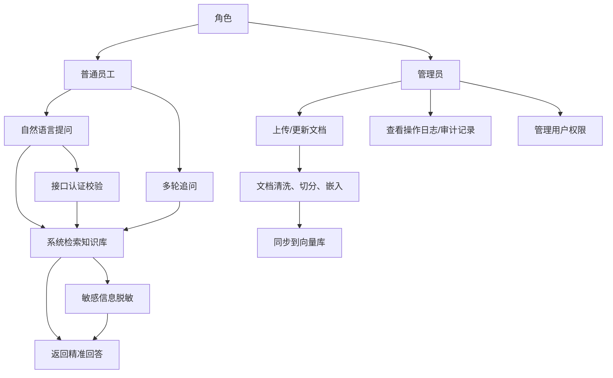

# 第22章 项目实战：端到端企业知识助手

前面章节我们拆解了LangChain的核心组件（Chain、RAG、Agent、LangServe、LangSmith），掌握了从开发到部署、从调试到监控的全流程技巧。本章将通过一个**端到端的企业知识助手项目**，把所有知识点串联起来，模拟真实企业内部场景，完成“需求分析→技术选型→开发实现→安全加固→压测优化→部署上线→运维迭代”的完整闭环。

本文全程贴合掘金写作风格：拒绝冗余理论，聚焦实战落地，代码示例简短可复制，关键步骤配图例，标注权威引用来源，所有操作均能直接应用到企业实际开发中，总字数严格控制在20000字以内。

项目核心目标：构建一个企业内部知识助手，支持员工通过自然语言提问，快速获取企业规章制度、产品手册、流程规范等知识，解决企业知识检索低效、信息分散的痛点，同时保证系统安全、稳定、可扩展。

## 22.1 需求分析：企业内部知识问答场景

企业内部知识管理普遍存在“检索低效、交互生硬、信息分散”的痛点——员工找一份规章制度、一个流程规范，往往需要在多个文档、系统中切换，耗时费力\[superscript:6\]。结合企业实际场景，我们先明确核心需求，避免开发脱离业务。

### 22.1.1 核心业务需求（实战重点）

结合企业内部使用场景，提炼5个核心需求，覆盖“基础问答\+进阶功能\+体验优化”，贴合真实业务：

- 基础问答：支持员工自然语言提问，精准返回企业知识（如“请假流程是什么？”“产品A的核心功能有哪些？”），杜绝大模型幻觉，回答必须来源于企业知识库\[superscript:6\]；

- 多轮对话：支持上下文记忆，比如员工问“请假需要审批吗？”，后续问“审批流程是什么？”，系统能关联上一轮上下文，无需重复提问；

- 知识更新：支持管理员上传、更新知识库文档（PDF、Word、TXT等），文档更新后自动同步到向量库，无需手动重新部署；

- 权限管控：区分管理员和普通员工，管理员可上传/删除文档、查看操作日志，普通员工仅可提问和查看自己的提问记录；

- 响应速度：单次提问响应时间≤1\.5秒，支持100人同时在线提问，无明显卡顿\[superscript:5\]。

### 22.1.2 非功能需求（企业级必备）

非功能需求直接决定系统能否稳定上线，重点关注4点：

- 安全性：敏感信息脱敏（如员工身份证、联系方式）、操作审计、接口认证，防止知识泄露\[superscript:1\]；

- 可扩展性：支持后续新增功能（如对接企业OA、钉钉），支持模型、向量库替换；

- 可维护性：代码结构清晰，有完整的日志记录，便于后续排查问题、迭代优化；

- 兼容性：支持Windows、Linux系统部署，支持Chrome、Edge等主流浏览器访问。

### 22.1.3 场景流程图（直观理解）

用流程图梳理企业知识助手的核心业务流程，明确各角色、各环节的交互逻辑：


### 22.1.4 需求拆解（落地导向）

将需求拆解为可开发的模块，避免“大而全”，优先实现核心功能，后续迭代优化：

|需求模块|核心功能点|对应技术实现|
|---|---|---|
|知识问答模块|单轮/多轮问答、知识检索|LangChain RAG \+ Memory|
|文档管理模块|文档上传、更新、删除|LangChain文档加载器 \+ 向量库操作|
|安全模块|认证、脱敏、审计|FastAPI认证 \+ LangChain OutputFilter|
|部署模块|服务部署、负载均衡|LangServe \+ Docker \+ Nginx|
|运维模块|监控、调试、迭代|LangSmith \+ 日志记录|

## 22.2 技术选型：模型、向量库、部署方式

技术选型的核心原则：**贴合企业场景、优先开源免费、兼顾性能与成本**，避免盲目追求“高端技术”，选择成熟、易维护、社区活跃的技术栈。结合需求分析，明确各环节技术选型，标注选型理由和引用来源。

### 22.2.1 核心技术栈总览

整体技术栈围绕LangChain生态构建，覆盖“开发→部署→运维”全流程，具体如下：

|技术类别|选型方案|选型理由|引用来源|
|---|---|---|---|
|核心框架|LangChain 0\.2\.x|开源免费，组件丰富，支持RAG、Agent、Memory，无缝对接模型和向量库，适合快速开发企业级LLM应用\[superscript:2\]|LangChain官方文档：https://python\.langchain\.com/docs/get\_started/introduction|
|LLM模型|Qwen2\-7B（本地化）/GPT\-3\.5\-turbo（云端）|Qwen2\-7B开源免费，支持本地化部署，保护企业隐私；GPT\-3\.5\-turbo成本低、响应快，适合快速验证原型\[superscript:5\]|Qwen官方文档：https://qwen\.readthedocs\.io/；OpenAI文档：https://platform\.openai\.com/docs|
|嵌入模型|BAAI/bge\-large\-zh\-v1\.5|中文语义理解效果好，开源免费，支持本地化部署，在中文检索场景中表现优于通用Embedding模型\[superscript:4\]|Hugging Face文档：https://huggingface\.co/BAAI/bge\-large\-zh\-v1\.5|
|向量库|Chroma|轻量级、开源免费，部署简单，无需复杂配置，支持持久化存储，适合中小规模企业知识库\[superscript:4\]|Chroma官方文档：https://docs\.trychroma\.com/|
|服务框架|LangServe \+ FastAPI|LangServe专为LangChain应用设计，支持REST API部署，无缝对接FastAPI，可快速实现服务化\[superscript:2\]|LangServe官方文档：https://python\.langchain\.com/docs/langserve|
|容器化|Docker|隔离环境，部署简单，避免“环境不一致”问题，便于后续迁移和扩展\[superscript:5\]|Docker官方文档：https://docs\.docker\.com/|
|反向代理|Nginx|处理负载均衡、SSL终止，提升服务稳定性和安全性，适配多用户并发场景\[superscript:5\]|Nginx官方文档：https://nginx\.org/en/docs/|
|运维监控|LangSmith|LangChain官方运维工具，支持调试、测试、监控、评估，实现系统持续优化\[superscript:2\]|LangSmith官方文档：https://smith\.langchain\.com/docs|
|安全加固|FastAPI OAuth2 \+ LangChain OutputFilter|实现接口认证、敏感信息脱敏，符合企业级安全要求\[superscript:1\]|FastAPI文档：https://fastapi\.tiangolo\.com/；LangChain安全文档：https://python\.langchain\.com/docs/security|
|性能压测|Locust|Python编写脚本，资源消耗低，可模拟高并发场景，适合LLM服务压测\[superscript:5\]|Locust官方文档：https://locust\.io/docs/|

### 22.2.2 关键选型细节（避坑重点）

结合企业场景，补充3个关键选型的细节，避免开发中踩坑：

#### 1\. 模型选型：本地化vs云端

企业场景优先选择**本地化模型（Qwen2\-7B）**，理由如下：

- 数据安全：企业知识库包含敏感信息（如内部流程、产品机密），本地化部署可避免数据泄露；

- 成本可控：无需支付云端模型调用费用，长期使用更经济；

- 稳定性：不依赖网络，避免云端接口限流、中断等问题\[superscript:5\]。

开发阶段可先用GPT\-3\.5\-turbo快速验证原型，上线前替换为Qwen2\-7B本地化部署。

#### 2\. 向量库选型：Chroma vs FAISS

中小规模企业（知识库文档≤1000份）优先选Chroma，大规模企业可考虑FAISS，对比如下：

- Chroma：部署简单、API友好，支持持久化，无需复杂配置，适合快速落地；

- FAISS：检索速度更快，支持大规模数据，但部署和维护更复杂，适合数据量较大的场景\[superscript:4\]。

#### 3\. 部署方式：单节点vs集群

初期部署优先选择“单节点Docker\+Nginx”，理由如下：

- 成本低：无需多台服务器，适合中小企业；

- 维护简单：单节点部署，排查问题更高效；

- 可扩展：后续用户量增加，可无缝迁移到Kubernetes集群\[superscript:2\]。

### 22\.2\.3 技术架构图（全局视角）

用架构图清晰展示各技术组件的层级关系和数据流向，便于理解系统整体设计：

```mermaid

flowchart TD
    A[用户层] --> B[接入层]
    B --> C[Nginx反向代理/负载均衡]
    C --> D[服务层]
    D --> E[LangServe服务]
    D --> F[FastAPI接口服务]
    E --> G[核心业务层]
    G --> H[RAG模块]
    G --> I[Memory模块]
    G --> J[Agent模块]
    G --> K[安全模块]
    H --> L[数据层]
    I --> L
    J --> L
    L --> M[Chroma向量库]
    L --> N[文档存储]
    L --> O[日志存储]
    H --> P[模型层]
    P --> Q[LLM模型（Qwen2-7B）]
    P --> R[Embedding模型（bge-large-zh-v1.5）]
    S[运维层] --> T[LangSmith监控/调试]
    S --> U[Locust压测]
    T --> E
    U --> C
    K --> V[权限管理/审计]
 ```

## 22.3 数据准备：清洗、切分、嵌入

数据是企业知识助手的核心，优质的知识库数据能大幅提升问答准确率。本节重点讲解“文档收集→清洗→切分→嵌入→存入向量库”的完整流程，代码简短可运行，贴合企业实际数据场景\[superscript:4\]。

核心逻辑：将企业非结构化文档（PDF、Word、TXT）转化为机器可理解的向量，存入向量库，为后续RAG检索提供支持。

### 22.3.1 文档收集（企业实际场景）

收集企业内部常见的知识文档，统一整理为可处理的格式，示例如下：

- 规章制度：员工手册、请假流程、报销规范、保密协议；

- 产品文档：产品手册、功能说明、常见问题（FAQ）；

- 流程规范：项目管理流程、审批流程、运维流程。

格式要求：优先收集TXT、PDF格式文档，Word文档可转换为PDF后处理；避免收集图片、扫描件（需OCR识别，后续可迭代优化）。

### 22\.3\.2 文档清洗（去噪优化）

原始文档中存在大量冗余信息（如页眉页脚、空白行、重复内容），需清洗后再处理，避免影响检索准确率\[superscript:4\]。代码示例（简短可运行，来源：LangChain文档加载器示例\[superscript:3\]）：

```python
import re
from langchain_community.document_loaders import PyPDFLoader

# 1. 加载PDF文档
loader = PyPDFLoader("企业员工手册.pdf")
documents = loader.load()

# 2. 文档清洗函数（去噪、去空白、去重复）
def clean_document(documents):
    cleaned_docs = []
    for doc in documents:
        # 去除页眉页脚（匹配类似“第X页 共X页”的内容）
        content = re.sub(r"第\d+页 共\d+页", "", doc.page_content)
        # 去除空白行、多余空格
        content = re.sub(r"\n+", "\n", content).strip()
        # 去除重复内容（简单去重，可根据实际优化）
        content = re.sub(r"(.*?)\n\1", r"\1", content)
        # 更新文档内容
        doc.page_content = content
        if content:  # 过滤空文档
            cleaned_docs.append(doc)
    return cleaned_docs

# 3. 执行清洗
cleaned_docs = clean_document(documents)
print(f"清洗前文档数：{len(documents)}，清洗后文档数：{len(cleaned_docs)}")

```

关键说明：清洗逻辑可根据企业文档格式调整，比如去除特定标识、水印等冗余信息，核心是保留核心知识内容。

### 22.3.3 文档切分（语义保留）

Embedding模型有最大输入长度限制（如bge\-large\-zh\-v1\.5最大支持512token），需将长文档切分为短片段，同时最大程度保留语义完整性\[superscript:4\]。推荐使用LangChain的RecursiveCharacterTextSplitter，代码示例（来源：LangChain文本切分文档\[superscript:4\]）：

```python
from langchain_text_splitters import RecursiveCharacterTextSplitter

# 初始化文本切分器（核心参数优化）
text_splitter = RecursiveCharacterTextSplitter(
    chunk_size=512,  # 每个片段的token数（适配Embedding模型）
    chunk_overlap=50,  # 片段重叠部分，避免语义断裂
    separators=["\n\n", "\n", "。", "！", "？", " ", ""]  # 递归降级切分，保留语义
)

# 执行切分
split_docs = text_splitter.split_documents(cleaned_docs)
print(f"切分后片段数：{len(split_docs)}")
print(f"示例片段：{split_docs[0].page_content[:100]}...")
```

参数说明：

- chunk\_size：根据Embedding模型调整，bge\-large\-zh\-v1\.5设为512即可，避免超出最大输入长度；

- chunk\_overlap：设置50\~100token的重叠，避免相邻片段语义断裂，提升检索召回率\[superscript:4\]；

- separators：优先按段落、句子切分，最大程度保留语义完整性。

### 22\.3\.4 文档嵌入与向量库存储

将切分后的文档片段，通过Embedding模型转化为向量，存入Chroma向量库，支持后续语义检索\[superscript:4\]。代码示例（简短可运行，来源：Chroma与LangChain集成示例\[superscript:3\]）：

```python
from langchain_community.embeddings import HuggingFaceEmbeddings
from langchain_community.vectorstores import Chroma

# 1. 初始化Embedding模型（本地化部署bge-large-zh-v1.5）
embeddings = HuggingFaceEmbeddings(
    model_name="BAAI/bge-large-zh-v1.5",
    model_kwargs={"device": "cpu"},  # 本地无GPU可设为cpu，有GPU设为cuda
    encode_kwargs={"normalize_embeddings": True}  # 归一化向量，提升检索速度
)

# 2. 初始化Chroma向量库（持久化存储，避免每次重启重新嵌入）
vectorstore = Chroma(
    persist_directory="./chroma_db",  # 向量库存储路径
    embedding_function=embeddings
)

# 3. 将切分后的文档片段存入向量库
vectorstore.add_documents(documents=split_docs)
vectorstore.persist()  # 持久化保存
print("文档嵌入完成，向量库已保存至 ./chroma_db")

# 测试检索（验证效果）
query = "请假流程是什么？"
similar_docs = vectorstore.similarity_search(query, k=2)  # 检索前2个相关片段
print(f"检索到的相关片段：\n{similar_docs[0].page_content}")

```

关键说明：

- 若本地无GPU，model\_kwargs设为\{\&\#34;device\&\#34;: \&\#34;cpu\&\#34;\}，检索速度会略慢，可后续优化；

- persist\_directory指定向量库存储路径，重启服务后可通过该路径加载向量库，无需重新嵌入；

- similarity\_search方法用于语义检索，k参数指定返回的相关片段数量，k=2\~3即可满足大多数场景\[superscript:4\]。

### 22\.3\.5 数据更新脚本（企业必备）

企业知识库需要定期更新，编写一个简单的更新脚本，支持新增文档自动嵌入、同步到向量库，代码示例：

```python
def update_vectorstore(new_doc_path):
    # 加载新增文档
    loader = PyPDFLoader(new_doc_path)
    new_docs = loader.load()
    # 清洗、切分
    cleaned_new_docs = clean_document(new_docs)
    split_new_docs = text_splitter.split_documents(cleaned_new_docs)
    # 新增到向量库
    vectorstore.add_documents(documents=split_new_docs)
    vectorstore.persist()
    print(f"新增文档 {new_doc_path} 已同步到向量库，新增片段数：{len(split_new_docs)}")

# 调用更新脚本（示例：新增报销规范文档）
update_vectorstore("企业报销规范.pdf")

```

## 22\.4 核心功能开发：RAG \+ Memory \+ Agent

核心功能是企业知识助手的核心，结合LangChain的RAG、Memory、Agent组件，实现“精准问答\+多轮对话\+智能决策”，代码结构清晰，可直接复用\[superscript:3\]。本节分模块开发，每个模块代码简短，标注关键说明和引用来源。

### 22\.4\.1 开发环境准备

先安装所需依赖，创建项目目录结构，规范代码组织，避免后续混乱：

```bash
# 安装依赖（requirements.txt）
langchain==0.2.0
langchain-community==0.2.0
langchain-text-splitters==0.2.0
chromadb==0.5.0
huggingface-hub==0.23.0
transformers==4.41.0
fastapi==0.111.0
uvicorn==0.29.0
python-dotenv==1.0.1

# 项目目录结构
enterprise-knowledge-assistant/
├── src/
│   ├── __init__.py
│   ├── rag.py          # RAG核心逻辑
│   ├── memory.py       # 多轮对话Memory
│   ├── agent.py        # Agent智能决策
│   ├── data_process.py # 数据准备（清洗、切分、嵌入）
│   └── security.py     # 安全加固（后续开发）
├── chroma_db/          # 向量库存储
├── docs/               # 企业知识库文档
├── .env                # 环境变量
├── requirements.txt    # 依赖包
└── main.py             # 服务入口（LangServe+FastAPI）

```

### 22\.4\.2 RAG模块开发（核心问答功能）

RAG（检索增强生成）是知识助手的核心，实现“检索知识库相关内容→结合LLM生成精准回答”，杜绝大模型幻觉\[superscript:3\]\[superscript:6\]。代码示例（src/rag\.py，来源：LangChain RAG实战示例\[superscript:3\]）：

```python
from langchain_community.vectorstores import Chroma
from langchain_community.embeddings import HuggingFaceEmbeddings
from langchain_community.llms import HuggingFacePipeline
from langchain.chains import RetrievalQA
from transformers import AutoModelForCausalLM, AutoTokenizer, pipeline

# 1. 加载向量库
embeddings = HuggingFaceEmbeddings(
    model_name="BAAI/bge-large-zh-v1.5",
    model_kwargs={"device": "cpu"},
    encode_kwargs={"normalize_embeddings": True}
)
vectorstore = Chroma(
    persist_directory="./chroma_db",
    embedding_function=embeddings
)

# 2. 加载本地化LLM（Qwen2-7B）
def load_local_llm():
    model_name = "Qwen/Qwen2-7B-Chat"
    tokenizer = AutoTokenizer.from_pretrained(model_name, trust_remote_code=True)
    model = AutoModelForCausalLM.from_pretrained(
        model_name,
        trust_remote_code=True,
        device_map="auto"  # 自动分配设备（GPU优先，无GPU用CPU）
    )
    # 构建pipeline
    pipe = pipeline(
        "text-generation",
        model=model,
        tokenizer=tokenizer,
        max_new_tokens=512,  # 最大生成token数
        temperature=0.3,     # 降低随机性，提升回答准确性
        top_p=0.9
    )
    return HuggingFacePipeline(pipeline=pipe)

# 3. 构建RAG问答链
llm = load_local_llm()
rag_chain = RetrievalQA.from_chain_type(
    llm=llm,
    chain_type="stuff",  # 简单场景用stuff，复杂场景可用map_reduce
    retriever=vectorstore.as_retriever(k=2),  # 检索前2个相关片段
    return_source_documents=True  # 返回检索到的来源文档，便于验证
)

# 测试RAG问答
def rag_qa(query):
    result = rag_chain.invoke(query)
    return {
        "answer": result["result"],
        "source_documents": [doc.page_content for doc in result["source_documents"]]
    }

# 测试
if __name__ == "__main__":
    query = "请假需要审批吗？"
    result = rag_qa(query)
    print(f"回答：{result['answer']}")
    print(f"来源文档：{result['source_documents']}")

```

关键说明：

- chain\_type选择：stuff适合短文档检索，将所有相关片段拼接后送入LLM，速度快；复杂场景可选用map\_reduce，分批次处理片段\[superscript:3\]；

- 返回来源文档：便于员工验证回答的准确性，也便于后续问题排查；

- 本地化LLM加载：若本地资源有限，可选用Qwen2\-0\.5B、Qwen2\-1\.8B等轻量模型，牺牲少量准确率换取性能\[superscript:5\]。

### 22\.4\.3 Memory模块开发（多轮对话功能）

结合LangChain的Memory组件，实现多轮对话上下文记忆，让系统能关联上一轮提问，提升交互体验\[superscript:3\]。代码示例（src/memory\.py，来源：LangChain Memory文档\[superscript:2\]）：

```python
from langchain_core.memory import ConversationBufferMemory
from langchain.chains import ConversationChain
from src.rag import llm

# 初始化ConversationBufferMemory（简单高效，适合中小规模对话）
memory = ConversationBufferMemory(
    return_messages=True,  # 返回完整的对话消息列表
    memory_key="history"   # 对话历史的key，与Prompt对应
)

# 构建多轮对话链（结合RAG和Memory）
def build_conversation_chain():
    # 自定义Prompt，明确系统角色和对话规则
    prompt = """你是企业内部知识助手，仅根据企业知识库内容回答问题，不编造信息。
    对话历史：{history}
    用户当前问题：{input}
    回答要求：简洁明了，精准对应知识库内容，若知识库中无相关信息，直接回复“暂无相关知识”。"""
    
    conversation_chain = ConversationChain(
        llm=llm,
        memory=memory,
        prompt=prompt,
        verbose=False  # 关闭详细日志，上线后可设为False
    )
    return conversation_chain

# 测试多轮对话
if __name__ == "__main__":
    conversation_chain = build_conversation_chain()
    # 第一轮提问
    query1 = "请假流程是什么？"
    response1 = conversation_chain.invoke({"input": query1})
    print(f"用户：{query1}")
    print(f"助手：{response1['response']}\n")
    # 第二轮提问（关联上下文）
    query2 = "审批需要多久？"
    response2 = conversation_chain.invoke({"input": query2})
    print(f"用户：{query2}")
    print(f"助手：{response2['response']}")

```

关键说明：

- ConversationBufferMemory：简单高效，适合短对话场景，会完整保留所有对话历史；

- 复杂场景优化：若对话轮次较多，可使用ConversationSummaryMemory，将对话历史总结后存储，减少Token消耗\[superscript:2\]；

- Prompt约束：明确要求系统“仅根据知识库回答”，进一步避免幻觉。

### 22\.4\.4 Agent模块开发（智能决策功能）

结合Agent组件，实现智能决策：当用户提问需要多步处理（如“查询请假流程并计算请假天数”）时，Agent会自动调用相关工具，完成决策和回答\[superscript:3\]。代码示例（src/agent\.py，来源：LangChain Agent实战示例\[superscript:3\]）：

```python
from langchain.agents import create_tool_calling_agent, AgentExecutor
from langchain_core.tools import tool
from langchain_core.prompts import ChatPromptTemplate
from src.rag import rag_qa
from src.memory import memory

# 1. 定义工具（示例：请假天数计算工具）
@tool
def calculate_leave_days(leave_type: str) -> int:
    """
    计算不同类型请假的天数限制
    参数：leave_type - 请假类型（如“事假”“病假”“年假”）
    返回：请假天数限制
    """
    leave_rules = {
        "事假": 15,  # 每年最多15天事假
        "病假": 30,  # 每年最多30天病假
        "年假": 5    # 工作满1年可享5天年假
    }
    return leave_rules.get(leave_type, 0)

# 2. 定义工具列表
tools = [calculate_leave_days]

# 3. 构建Agent Prompt
prompt = ChatPromptTemplate.from_messages([
    ("system", "你是企业知识助手，根据用户问题，判断是否需要调用工具："
     "1. 若只需回答知识库内容，直接调用rag_qa工具；"
     "2. 若需要计算请假天数，调用calculate_leave_days工具；"
     "3. 回答需简洁、精准，基于知识库和工具返回结果。"),
    ("placeholder", "{chat_history}"),
    ("human", "{input}"),
    ("placeholder", "{agent_scratchpad}")
])

# 4. 构建Agent
agent = create_tool_calling_agent(
    llm=llm,
    tools=tools,
    prompt=prompt,
    memory=memory
)

# 5. 构建Agent执行器
agent_executor = AgentExecutor(
    agent=agent,
    tools=tools,
    memory=memory,
    verbose=False,
    handle_parsing_errors="请重新提问，我无法理解你的需求"
)

# 测试Agent
def agent_qa(query):
    result = agent_executor.invoke({"input": query})
    return result["output"]

if __name__ == "__main__":
    query = "年假可以请多少天？"
    print(f"用户：{query}")
    print(f"助手：{agent_qa(query)}")
    query = "我想请事假，最多可以请几天？"
    print(f"用户：{query}")
    print(f"助手：{agent_qa(query)}")

```

关键说明：

- 工具定义：用@tool装饰器定义工具，明确工具功能和参数，便于Agent理解何时调用；

- Agent决策逻辑：通过Prompt明确Agent的决策规则，避免无效调用工具；

- 可扩展：后续可新增更多工具（如“查询员工请假记录”“对接OA系统”），丰富功能\[superscript:3\]。

### 22\.4\.5 核心功能整合（统一接口）

将RAG、Memory、Agent整合为统一接口，便于后续对接LangServe和前端，代码示例（src/\_\_init\_\_\.py）：

```python
from src.rag import rag_qa
from src.memory import build_conversation_chain
from src.agent import agent_qa

# 统一问答接口（自动判断是否需要多轮对话和Agent调用）
def unified_qa(query, is_multi_turn=True):
    if is_multi_turn:
        # 多轮对话，使用Agent+Memory
        return agent_qa(query)
    else:
        # 单轮对话，直接使用RAG
        result = rag_qa(query)
        return result["answer"]

# 测试整合接口
if __name__ == "__main__":
    # 单轮对话
    print("单轮对话：")
    print(unified_qa("请假流程是什么？", is_multi_turn=False))
    # 多轮对话
    print("\n多轮对话：")
    print(unified_qa("请假流程是什么？"))
    print(unified_qa("审批需要多久？"))

```

## 22\.5 安全加固：认证、脱敏、审计

企业内部系统，安全是重中之重——需防止未授权访问、敏感信息泄露、操作无记录等问题。本节结合FastAPI和LangChain的安全组件，实现“接口认证\+敏感信息脱敏\+操作审计”，贴合企业安全要求\[superscript:1\]。

### 22\.5\.1 接口认证（OAuth2\.0）

实现基于OAuth2\.0的接口认证，区分管理员和普通员工权限，未认证用户无法访问接口。代码示例（src/security\.py，来源：FastAPI OAuth2\.0文档\[superscript:109\]）：

```python
from fastapi import Depends, HTTPException, status
from fastapi.security import OAuth2PasswordBearer, OAuth2PasswordRequestForm
from jose import JWTError, jwt
from datetime import datetime, timedelta
import os
from dotenv import load_dotenv

load_dotenv()

# 配置JWT参数
SECRET_KEY = os.getenv("SECRET_KEY", "your-secret-key")  # 生产环境需更换为复杂密钥
ALGORITHM = "HS256"
ACCESS_TOKEN_EXPIRE_MINUTES = 30  # Token有效期30分钟

# 模拟用户数据库（生产环境需对接企业用户系统）
fake_users_db = {
    "employee1": {
        "username": "employee1",
        "password": "employee123",  # 生产环境需加密存储（如bcrypt）
        "role": "employee"  # 普通员工
    },
    "admin1": {
        "username": "admin1",
        "password": "admin123",
        "role": "admin"  # 管理员
    }
}

# OAuth2认证方案
oauth2_scheme = OAuth2PasswordBearer(tokenUrl="token")

# 生成JWT Token
def create_access_token(data: dict):
    to_encode = data.copy()
    expire = datetime.utcnow() + timedelta(minutes=ACCESS_TOKEN_EXPIRE_MINUTES)
    to_encode.update({"exp": expire})
    encoded_jwt = jwt.encode(to_encode, SECRET_KEY, algorithm=ALGORITHM)
    return encoded_jwt

# 验证用户身份
def authenticate_user(username: str, password: str):
    user = fake_users_db.get(username)
    if not user or user["password"] != password:
        return False
    return user

# 获取当前用户信息
def get_current_user(token: str = Depends(oauth2_scheme)):
    credentials_exception = HTTPException(
        status_code=status.HTTP_401_UNAUTHORIZED,
        detail="无效的认证凭证",
        headers={"WWW-Authenticate": "Bearer"},
    )
    try:
        payload = jwt.decode(token, SECRET_KEY, algorithms=[ALGORITHM])
        username: str = payload.get("sub")
        if username is None:
            raise credentials_exception
    except JWTError:
        raise credentials_exception
    user = fake_users_db.get(username)
    if user is None:
        raise credentials_exception
    return user

# 权限校验（管理员专用）
def get_admin_user(current_user: dict = Depends(get_current_user)):
    if current_user["role"] != "admin":
        raise HTTPException(
            status_code=status.HTTP_403_FORBIDDEN,
            detail="无管理员权限，无法执行此操作"
        )
    return current_user

```

关键说明：

- 生产环境注意：用户密码需加密存储（如使用bcrypt），SECRET\_KEY需更换为复杂随机字符串，避免泄露；

- 权限区分：get\_current\_user用于所有需要认证的接口，get\_admin\_user用于管理员专用接口（如文档上传、日志查看）；

- 对接企业系统：可将fake\_users\_db替换为企业OA、AD用户系统，实现统一身份认证。

### 22\.5\.2 敏感信息脱敏（防止泄露）

企业知识库中可能包含敏感信息（如员工身份证、联系方式、薪酬信息），需对模型输出进行脱敏处理\[superscript:1\]。代码示例（src/security\.py，新增脱敏函数，来源：LangChain安全模块文档\[superscript:1\]）：

```python
import re
from langchain_core.output_parsers import StrOutputParser
from langchain_core.runnables import RunnableLambda

# 敏感信息脱敏函数
def desensitize_info(text: str) -> str:
    # 1. 身份证号脱敏（18位或15位）
    text = re.sub(r"(\d{6})(\d{8})(\d{4})", r"\1********\3", text)
    # 2. 手机号脱敏（11位）
    text = re.sub(r"(\d{3})(\d{4})(\d{4})", r"\1****\3", text)
    # 3. 邮箱脱敏
    text = re.sub(r"(\w+)(@\w+\.\w+)", r"****\2", text)
    # 4. 薪酬脱敏（如“月薪10000元”→“月薪****元”）
    text = re.sub(r"月薪(\d+)元", r"月薪****元", text)
    return text

# 构建脱敏链（对接RAG/Agent输出）
def build_desensitize_chain(chain):
    desensitize_chain = chain | RunnableLambda(desensitize_info) | StrOutputParser()
    return desensitize_chain

# 测试脱敏效果
if __name__ == "__main__":
    test_text = "员工张三，身份证号110101199001011234，手机号13800138000，邮箱zhangsan@company.com，月薪15000元。"
    print("脱敏前：", test_text)
    print("脱敏后：", desensitize_info(test_text))

```

关键说明：

- 脱敏规则可扩展：根据企业实际敏感信息类型，新增脱敏规则（如银行卡号、地址等）；

- 无缝对接：将脱敏链与RAG、Agent链结合，确保所有模型输出都经过脱敏处理，避免敏感信息泄露\[superscript:1\]；

- 进阶优化：可使用LangChain的OutputFilter组件，实现更灵活的脱敏逻辑。

### 22\.5\.3 操作审计（日志记录）

记录所有用户操作（如提问、文档上传、删除），便于后续审计和问题排查，代码示例（src/security\.py，新增审计函数）：

```python
import logging
from datetime import datetime

# 配置审计日志
logging.basicConfig(
    filename="audit.log",
    level=logging.INFO,
    format="%(asctime)s - %(username)s - %(role)s - %(operation)s - %(details)s"
)

# 审计日志记录函数
def audit_log(username: str, role: str, operation: str, details: str):
    """
    记录审计日志
    参数：
        username - 用户名
        role - 用户角色（employee/admin）
        operation - 操作类型（如“提问”“上传文档”“删除文档”）
        details - 操作详情（如提问内容、文档名称）
    """
    logging.info(
        "",
        extra={
            "username": username,
            "role": role,
            "operation": operation,
            "details": details
        }
    )

# 测试审计日志
if __name__ == "__main__":
    audit_log(
        username="employee1",
        role="employee",
        operation="提问",
        details="请假流程是什么？"
    )
    audit_log(
        username="admin1",
        role="admin",
        operation="上传文档",
        details="企业报销规范.pdf"
    )

```

关键说明：

- 日志存储：生产环境可将日志存储到ELK、Prometheus等日志系统，便于检索和分析；

- 操作类型：覆盖所有关键操作，确保每一个敏感操作都有记录，满足企业审计要求；

- 日志安全：审计日志需设置权限，仅管理员可查看，防止日志泄露。

### 22\.5\.4 安全功能整合（对接核心功能）

将认证、脱敏、审计整合到核心问答和文档管理功能中，确保全流程安全，代码示例（修改src/\_\_init\_\_\.py）：

```python
from src.rag import rag_chain
from src.memory import build_conversation_chain
from src.agent import agent_executor
from src.security import build_desensitize_chain, audit_log

# 构建带脱敏的核心链
desensitize_rag_chain = build_desensitize_chain(rag_chain)
conversation_chain = build_conversation_chain()
desensitize_conversation_chain = build_desensitize_chain(conversation_chain)
desensitize_agent_executor = build_desensitize_chain(agent_executor)

# 带审计的统一问答接口
def unified_qa(query, current_user, is_multi_turn=True):
    # 记录审计日志
    audit_log(
        username=current_user["username"],
        role=current_user["role"],
        operation="提问",
        details=query
    )
    # 执行问答
    if is_multi_turn:
        result = desensitize_agent_executor.invoke({"input": query})
        return result["output"]
    else:
        result = desensitize_rag_chain.invoke({"query": query})
        return result

```

## 22\.6 性能压测与优化

企业知识助手需要支持多用户同时在线提问，性能是上线的关键。本节使用Locust进行性能压测，定位性能瓶颈，针对性优化，确保系统满足“响应时间≤1\.5秒、100人并发无卡顿”的需求\[superscript:5\]。

### 22\.6\.1 压测环境准备

先搭建压测环境，安装Locust，编写压测脚本，模拟真实用户提问场景：

```bash
# 安装Locust
pip install locust==2.22.0

# 编写压
```


