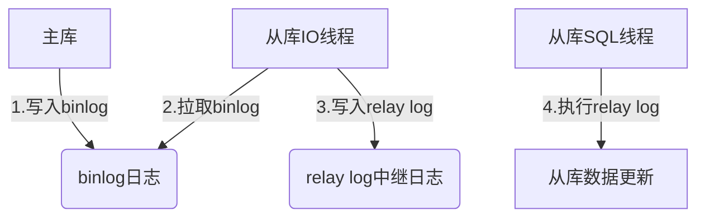
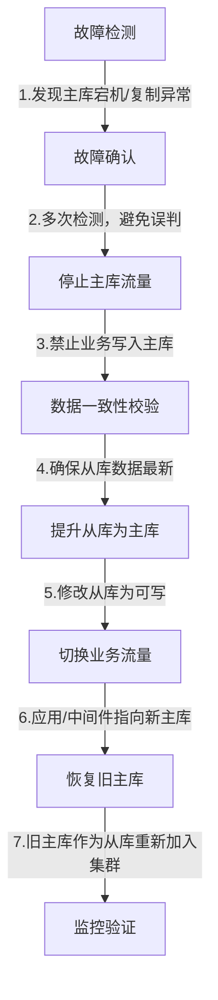

# MySQL 数据库应用指南：第15章 MySQL高可用架构实践

在生产环境中，数据库的“不可用”意味着业务直接中断——无论是服务器宕机、网络故障，还是数据损坏，都会造成不可估量的损失。高可用（High Availability，HA）架构的核心目标是**最大限度减少数据库停机时间**，保障业务持续可用。本章将从高可用核心需求、主从复制、组复制（MGR），到故障切换和工具选型，全面讲解 MySQL 高可用架构的设计与落地实践。

## 15.1 高可用架构的核心需求与评估指标

### 15.1.1 高可用的核心需求

企业级 MySQL 高可用架构需满足以下核心诉求，缺一不可：

1. **故障自动检测**：快速发现主库宕机、复制异常等故障；
2. **故障自动切换**：无需人工介入，秒级将业务流量切换到备用节点；
3. **数据一致性**：切换后数据无丢失、无错乱，满足业务数据完整性要求；
4. **性能无显著下降**：高可用架构不能过度牺牲数据库性能（如复制延迟、集群开销）；
5. **可扩展性**：架构支持节点扩容，适配业务增长；
6. **运维成本可控**：避免过度复杂的架构，降低运维难度。

### 15.1.2 核心评估指标

衡量高可用架构的效果，需聚焦以下关键指标：
| 指标 | 定义 | 企业级目标 |
|------|------|------------|
| **RTO（恢复时间目标）** | 故障发生到业务恢复的时长 | ≤30秒（核心业务）/ ≤5分钟（非核心业务） |
| **RPO（恢复点目标）** | 故障后允许丢失的数据量/时间 | ≤0秒（零数据丢失）/ ≤5秒（容忍少量丢失） |
| **可用性（Uptime）** | 年度可用时长占比 | ≥99.99%（即年度停机≤52.56分钟） |
| **复制延迟** | 从库与主库的数据同步延迟 | ≤1秒（核心业务）/ ≤5秒（非核心业务） |
| **切换成功率** | 故障切换的成功次数/总切换次数 | 100%（需通过演练验证） |

### 15.1.3 常见高可用架构选型

不同业务规模适配不同的高可用架构，核心选型对比：
| 架构类型 | 适用场景 | 优点 | 缺点 |
|----------|----------|------|------|
| 主从复制 + Keepalived | 中小业务（单主单从/单主多从） | 部署简单、成本低 | 手动切换（或半自动化）、复制延迟可能导致数据丢失 |
| 主从复制 + MHA | 中大型业务（单主多从） | 自动故障切换、零数据丢失（配置得当） | 仅支持单主，扩容复杂 |
| MySQL MGR（组复制） | 核心业务（多主/单主集群） | 原生高可用、数据强一致、自动切换 | 部署复杂、对网络要求高、性能开销略大 |
| 云厂商托管集群（RDS） | 所有业务 | 免运维、自动切换、按需扩容 | 成本高、定制化能力弱 |

## 15.2 MySQL主从复制的原理与配置

主从复制是 MySQL 高可用的基础，也是最常用的架构——主库负责写操作，从库负责读操作，既实现读写分离，又能在主库故障时切换到从库。

### 15.2.1 主从复制核心原理

MySQL 主从复制基于**二进制日志（binlog）** 实现，核心流程分为 3 步（经典的“三步复制”）：



1. **主库写入binlog**：主库执行的所有写操作（INSERT/UPDATE/DELETE）都会记录到 binlog；
2. **从库IO线程拉取binlog**：从库通过 IO 线程连接主库，请求获取 binlog，并将拉取到的内容写入本地 `relay log`（中继日志）；
3. **从库SQL线程执行relay log**：从库的 SQL 线程读取 relay log，逐条执行其中的 SQL 语句，实现数据与主库同步。

### 15.2.2 主从复制的核心模式

| 复制模式                | 同步方式                                  | 数据一致性                         | 性能 | 适用场景                       |
| ----------------------- | ----------------------------------------- | ---------------------------------- | ---- | ------------------------------ |
| 异步复制（Async）       | 主库写入binlog后立即返回，不等待从库确认  | 低（主库宕机可能丢失数据）         | 高   | 非核心业务、读多写少           |
| 半同步复制（Semi-sync） | 主库需等待至少1个从库确认接收binlog后返回 | 中（仅保证binlog传输，不保证执行） | 中   | 核心业务、对数据一致性要求较高 |
| 组复制（MGR）           | 基于Paxos协议，多数节点确认后才提交       | 高（强一致性）                     | 中低 | 核心业务、零数据丢失要求       |

### 15.2.3 主从复制实战配置（异步复制）

#### 环境准备

- 主库：192.168.1.100（MySQL 8.0）
- 从库：192.168.1.101（MySQL 8.0）
- 核心前提：主从库 MySQL 版本一致、配置文件基本相同、数据初始一致（可通过全量备份恢复）。

#### 步骤1：主库配置

1. 修改 `my.cnf` 开启 binlog 并配置唯一 server_id：

```ini
[mysqld]
# 开启binlog（复制必备）
log_bin = /var/lib/mysql/mysql-bin
binlog_format = ROW  # 行级复制，数据一致性更高
server_id = 100  # 唯一标识，不能与从库重复
# 可选：仅复制指定数据库（按需配置）
# binlog_do_db = test_db
# 可选：忽略复制的数据库
# binlog_ignore_db = mysql
```

2. 重启主库并创建复制专用账号：

```bash
systemctl restart mysqld
```

```sql
-- 创建复制账号（仅允许从库IP访问）
CREATE USER 'repl'@'192.168.1.101' IDENTIFIED BY 'Repl@123456';
-- 授予复制权限
GRANT REPLICATION SLAVE, REPLICATION CLIENT ON *.* TO 'repl'@'192.168.1.101';
FLUSH PRIVILEGES;

-- 查看主库binlog状态（记录File和Position，后续从库配置用）
SHOW MASTER STATUS;
-- 输出示例：
-- File: mysql-bin.000001
-- Position: 156
-- Binlog_Do_DB: test_db
-- Binlog_Ignore_DB: mysql
```

#### 步骤2：从库配置

1. 修改 `my.cnf` 配置 server_id：

```ini
[mysqld]
server_id = 101  # 与主库不同
relay_log = /var/lib/mysql/relay-bin  # 中继日志（默认开启）
read_only = ON  # 设为只读（仅超级用户可写）
log_slave_updates = ON  # 从库执行的复制操作写入自身binlog（便于级联复制）
```

2. 重启从库并配置复制：

```bash
systemctl restart mysqld
```

```sql
-- 停止现有复制（若有）
STOP SLAVE;

-- 配置主库信息
CHANGE REPLICATION SOURCE TO
SOURCE_HOST = '192.168.1.100',
SOURCE_USER = 'repl',
SOURCE_PASSWORD = 'Repl@123456',
SOURCE_LOG_FILE = 'mysql-bin.000001',  # 主库SHOW MASTER STATUS的File值
SOURCE_LOG_POS = 156;  # 主库SHOW MASTER STATUS的Position值

-- 启动复制
START SLAVE;

-- 查看复制状态（核心）
SHOW SLAVE STATUS\G;
```

关键状态字段（需均为 Yes）：

- `Slave_IO_Running`: Yes（IO线程正常，能拉取主库binlog）
- `Slave_SQL_Running`: Yes（SQL线程正常，能执行relay log）
- `Seconds_Behind_Master`: 0（复制延迟，0表示无延迟）

#### 步骤3：验证复制

```sql
-- 主库插入数据
USE test_db;
INSERT INTO user (name, phone) VALUES ('张三', '13800138000');

-- 从库查询数据（应能查到新增记录）
USE test_db;
SELECT * FROM user WHERE name = '张三';
```

### 15.2.4 半同步复制配置（可选）

异步复制存在数据丢失风险，核心业务建议开启半同步复制：

```sql
-- 主库安装半同步插件
INSTALL PLUGIN rpl_semi_sync_master SONAME 'semisync_master.so';
-- 开启主库半同步
SET GLOBAL rpl_semi_sync_master_enabled = ON;
-- 设置超时时间（毫秒，超时后降级为异步）
SET GLOBAL rpl_semi_sync_master_timeout = 1000;

-- 从库安装半同步插件
INSTALL PLUGIN rpl_semi_sync_slave SONAME 'semisync_slave.so';
-- 开启从库半同步
SET GLOBAL rpl_semi_sync_slave_enabled = ON;
-- 重启从库复制线程
STOP SLAVE IO_THREAD;
START SLAVE IO_THREAD;
```

## 15.3 主从复制的延迟问题与解决方法

复制延迟是主从架构的常见痛点——从库数据落后于主库，会导致读从库时获取不到最新数据，甚至切换后数据不一致。

### 15.3.1 复制延迟的核心原因

1. **主库写压力过大**：主库每秒产生大量binlog，从库SQL线程处理不及时；
2. **从库性能不足**：从库硬件配置低（CPU/内存/IO），无法跟上主库节奏；
3. **大事务/慢SQL**：主库执行大事务（如批量插入10万行），从库需耗时执行；
4. **索引缺失**：从库缺少索引，执行复制的SQL时全表扫描；
5. **网络延迟**：主从库跨机房部署，网络带宽不足或延迟高；
6. **单SQL线程瓶颈**：传统主从复制仅单SQL线程执行relay log，无法并行处理。

### 15.3.2 复制延迟的监控

```sql
-- 1. 查看从库延迟（核心指标）
SELECT Seconds_Behind_Master FROM INFORMATION_SCHEMA.PROCESSLIST WHERE COMMAND = 'Binlog Dump';

-- 2. 查看复制详细状态（定位延迟原因）
SHOW SLAVE STATUS\G;
-- 关注：
-- - Relay_Log_Space：中继日志大小（过大说明SQL线程处理慢）
-- - Last_SQL_Error：SQL线程错误（导致复制中断）
-- - Master_Log_File/Read_Master_Log_Pos：IO线程已拉取的binlog位置
-- - Relay_Master_Log_File/Exec_Master_Log_Pos：SQL线程已执行的binlog位置

-- 3. 开启复制延迟监控（MySQL 8.0+）
SET GLOBAL replication_sender_progress = ON;
SET GLOBAL replication_receiver_progress = ON;
```

### 15.3.3 复制延迟的解决方法

#### 1. 硬件层面优化

- 从库配置不低于主库（尤其是CPU和IO，推荐使用SSD）；
- 主从库同机房部署，降低网络延迟；
- 增大从库内存，提升InnoDB缓冲池命中率。

#### 2. 配置层面优化

```ini
# 从库my.cnf优化
[mysqld]
# 开启并行复制（MySQL 5.7+支持）
slave_parallel_type = LOGICAL_CLOCK  # 按逻辑时钟并行（基于事务组）
slave_parallel_workers = 8  # 并行线程数（建议等于CPU核心数）
slave_preserve_commit_order = ON  # 保证事务提交顺序与主库一致

# 增大中继日志缓存
relay_log_space_limit = 10G

# 禁用从库二进制日志（若无需级联复制）
# log_bin = OFF

# 优化从库SQL执行效率
innodb_buffer_pool_size = 8G  # 增大缓冲池
innodb_flush_log_at_trx_commit = 2  # 降低刷盘频率（牺牲少量一致性换性能）
```

#### 3. 业务层面优化

- **拆分大事务**：将主库的大事务拆分为多个小事务（如批量插入拆分为每次1000行）；
- **避免慢SQL**：主库执行的SQL需优化（加索引、减少扫描行数），避免从库执行慢；
- **读写分离优化**：
  - 核心业务的实时查询仍读主库，非实时查询读从库；
  - 引入中间件（如MyCat、Sharding-JDBC），自动路由实时查询到主库；
- **延迟容忍设计**：业务层面接受短时间延迟（如5秒），或通过缓存获取最新数据。

#### 4. 工具层面优化

- 使用 `pt-heartbeat`（Percona Toolkit）精准监控复制延迟：

  ```bash
  # 主库启动心跳
  pt-heartbeat --daemonize --database test_db --table heartbeat --update --master-server-id 100

  # 从库查看延迟（精确到毫秒）
  pt-heartbeat --database test_db --table heartbeat --monitor --slave-server-id 101
  ```

## 15.4 MySQL MGR（组复制）的部署与使用

MySQL Group Replication（MGR，组复制）是 MySQL 5.7.17 引入的原生高可用集群方案，基于 Paxos 协议实现多节点数据强一致，支持自动故障检测和切换，是核心业务的首选架构。

### 15.4.1 MGR 核心特性

1. **强一致性**：基于分布式共识算法，多数节点（N/2+1）确认后才提交事务；
2. **自动故障检测**：集群节点间实时通信，检测故障节点；
3. **自动故障切换**：主节点故障后，自动选举新主节点；
4. **多主/单主模式**：
   - 单主模式（默认）：仅一个主节点可写，其余为只读；
   - 多主模式：所有节点均可写（需业务适配，避免写冲突）；
5. **容错性**：N节点集群最多容忍 (N-1)/2 个节点故障（如3节点集群容忍1个故障）。

### 15.4.2 MGR 部署前提

1. 集群节点：至少3个（推荐奇数，如3/5节点），MySQL版本≥5.7.17（推荐8.0）；
2. 配置要求：
   - 开启 binlog，格式为 ROW；
   - 关闭 query_cache；
   - 开启 GTID（全局事务标识）；
   - 网络互通，节点间能访问3306和33061端口（MGR通信端口）。

### 15.4.3 MGR 实战部署（3节点单主集群）

#### 环境准备

- 节点1：192.168.1.100（主节点）
- 节点2：192.168.1.101（从节点）
- 节点3：192.168.1.102（从节点）

#### 步骤1：所有节点配置 `my.cnf`

```ini
[mysqld]
# 基础配置
server_id = 100  # 每个节点不同（100/101/102）
datadir = /var/lib/mysql
socket = /var/lib/mysql/mysql.sock
log_bin = /var/lib/mysql/mysql-bin
binlog_format = ROW
gtid_mode = ON
enforce_gtid_consistency = ON
log_slave_updates = ON
skip_slave_start = ON

# MGR核心配置
transaction_isolation = READ-COMMITTED  # 隔离级别（MGR要求）
binlog_checksum = NONE  # 关闭binlog校验和
master_info_repository = TABLE
relay_log_info_repository = TABLE
plugin_load_add = 'group_replication.so'  # 加载MGR插件
group_replication_group_name = 'aaaaaaaa-bbbb-cccc-dddd-eeeeeeeeeeee'  # 集群唯一UUID
group_replication_start_on_boot = OFF  # 不随MySQL启动
group_replication_local_address = '192.168.1.100:33061'  # 每个节点的本地通信地址
group_replication_group_seeds = '192.168.1.100:33061,192.168.1.101:33061,192.168.1.102:33061'  # 集群种子节点
group_replication_bootstrap_group = OFF  # 仅初始化时设为ON
group_replication_single_primary_mode = ON  # 单主模式
group_replication_enforce_update_everywhere_checks = OFF  # 单主模式设为OFF
```

#### 步骤2：所有节点创建MGR专用账号

```sql
CREATE USER 'mgr'@'%' IDENTIFIED BY 'MGR@123456';
GRANT REPLICATION SLAVE ON *.* TO 'mgr'@'%';
FLUSH PRIVILEGES;

-- 配置复制账号（MGR使用）
CHANGE MASTER TO MASTER_USER='mgr', MASTER_PASSWORD='MGR@123456' FOR CHANNEL 'group_replication_recovery';
```

#### 步骤3：初始化集群（仅节点1执行）

```sql
-- 安装MGR插件（若未配置plugin_load_add）
INSTALL PLUGIN group_replication SONAME 'group_replication.so';

-- 启动集群（仅首次初始化）
SET GLOBAL group_replication_bootstrap_group = ON;
START GROUP_REPLICATION;
SET GLOBAL group_replication_bootstrap_group = OFF;

-- 查看集群状态（节点1应显示为ONLINE）
SELECT * FROM performance_schema.replication_group_members;
```

#### 步骤4：加入其他节点（节点2、3执行）

```sql
-- 安装MGR插件
INSTALL PLUGIN group_replication SONAME 'group_replication.so';

-- 加入集群
START GROUP_REPLICATION;

-- 查看集群状态（所有节点应显示为ONLINE）
SELECT * FROM performance_schema.replication_group_members;
```

#### 步骤5：验证集群

```sql
-- 主节点（节点1）插入数据
USE test_db;
INSERT INTO user (name, phone) VALUES ('MGR测试', '13800138000');

-- 从节点（节点2、3）查询数据（应能查到）
USE test_db;
SELECT * FROM user WHERE name = 'MGR测试';

-- 模拟主节点故障（停止节点1的MySQL）
systemctl stop mysqld

-- 节点2/3会自动选举新主节点，查看新主节点
SELECT member_role FROM performance_schema.replication_group_members WHERE member_state = 'ONLINE';
```

## 15.5 高可用架构中的故障切换实现

故障切换是高可用架构的核心环节——从“检测故障”到“切换流量”，需保证快速、无数据丢失、业务无感知。

### 15.5.1 故障切换的核心流程



### 15.5.2 手动切换（应急场景）

适用于中小业务或自动化工具故障时的应急操作：

```sql
-- 1. 停止旧主库业务流量（如关闭应用连接）
-- 2. 确认从库数据最新（延迟为0）
SELECT Seconds_Behind_Master FROM INFORMATION_SCHEMA.PROCESSLIST WHERE COMMAND = 'Binlog Dump';

-- 3. 停止从库复制
STOP SLAVE;

-- 4. 将从库设为可写
SET GLOBAL read_only = OFF;

-- 5. 修改应用配置，指向新主库（192.168.1.101）
-- 6. 旧主库恢复后，作为新从库加入集群
CHANGE REPLICATION SOURCE TO
SOURCE_HOST = '192.168.1.101',
SOURCE_USER = 'repl',
SOURCE_PASSWORD = 'Repl@123456',
SOURCE_LOG_FILE = 'mysql-bin.000005',
SOURCE_LOG_POS = 200;
START SLAVE;
```

### 15.5.3 自动切换（生产环境推荐）

自动切换依赖专用工具，核心分为两类：

1. **基于VIP的切换（Keepalived）**：
   - 主从库绑定同一个VIP（如192.168.1.200）；
   - 主库故障时，Keepalived将VIP漂移到从库；
   - 优点：部署简单、切换快；缺点：仅检测节点存活，不校验复制状态，可能导致数据丢失。
2. **基于复制状态的切换（MHA/Orchestrator）**：
   - 先校验从库数据一致性，再选择最优从库提升为主库；
   - 优点：数据一致性高、零丢失；缺点：部署略复杂。

## 15.6 常用高可用工具（Keepalived、MHA）介绍

### 15.6.1 Keepalived：轻量级VIP漂移工具

Keepalived 基于 VRRP 协议实现 VIP 高可用，适合中小业务的主从架构快速切换。

#### 核心配置（主库 `keepalived.conf`）

```conf
global_defs {
   router_id mysql_master  # 唯一标识
}

vrrp_instance VI_1 {
    state MASTER  # 主库设为MASTER，从库设为BACKUP
    interface eth0  # 网卡名称
    virtual_router_id 51  # 虚拟路由ID（主从一致）
    priority 100  # 优先级（主库高于从库，如从库设为90）
    advert_int 1  # 心跳间隔（秒）
    authentication {
        auth_type PASS
        auth_pass 1111  # 认证密码（主从一致）
    }
    virtual_ipaddress {
        192.168.1.200/24  # 虚拟IP（VIP）
    }
}
```

#### 核心特点

- **优点**：部署简单、切换速度快（秒级）、资源占用低；
- **缺点**：
  - 仅检测节点存活（ping通即认为正常），不校验MySQL服务和复制状态；
  - 不支持多从库选择，仅能切换到指定从库；
  - 可能出现“脑裂”（主从库同时持有VIP），需配置抢占模式和延迟。

### 15.6.2 MHA：专业MySQL高可用工具

MHA（Master High Availability）是由日本DeNA公司开发的开源工具，专为MySQL主从架构设计，支持自动故障检测、最优从库选择、零数据丢失切换。

#### 核心组件

- **MHA Manager**：管理节点，负责故障检测和切换；
- **MHA Node**：数据节点，部署在所有主从库上，负责复制管理和数据修复。

#### 核心特点

- **自动故障检测**：实时监控主库状态，支持自定义检测脚本；
- **智能从库选择**：优先选择复制延迟最小、数据最新的从库提升为主库；
- **零数据丢失**：从主库残留的binlog中恢复未复制的数据；
- **在线切换**：支持手动触发主从切换（如主库维护）；
- **缺点**：
  - 仅支持MySQL 5.5-5.7（8.0需适配）；
  - 部署和配置较复杂；
  - 不支持MGR集群。

#### 部署参考

MHA 官方文档：https://code.google.com/archive/p/mysql-master-ha/（需科学上网）  
Percona 维护的 MHA 分支：https://github.com/percona/mha4mysql-manager

### 15.6.3 其他工具推荐

| 工具              | 定位                                 | 适用场景                               |
| ----------------- | ------------------------------------ | -------------------------------------- |
| Orchestrator      | 可视化MySQL拓扑管理工具              | 中大型主从集群、支持自动切换和拓扑重构 |
| ProxySQL          | 数据库中间件，支持读写分离和自动切换 | 高并发读写分离场景、需动态路由流量     |
| MySQL Router      | 官方中间件，适配MGR集群              | MGR集群的流量路由、自动感知节点状态    |
| Zookeeper + Kafka | 分布式协调，实现高可用切换           | 大型分布式架构、多集群联动切换         |

### 总结

1. 高可用架构的核心是满足 RTO/RPO 目标，中小业务可选择主从+Keepalived，核心业务推荐 MGR 集群；
2. 主从复制是高可用的基础，需关注复制延迟问题，通过并行复制、硬件升级、业务优化解决；
3. MGR 是 MySQL 原生高可用方案，基于 Paxos 实现强一致性，适合核心业务，但对网络和配置要求高；
4. 故障切换需保证“数据一致性优先”，手动切换仅用于应急，生产环境推荐 MHA/Orchestrator 等专业工具；
5. 高可用架构不是“部署完成就一劳永逸”，需定期演练故障切换，验证切换成功率和数据一致性。

MySQL 高可用的本质是“风险兜底”——架构设计需结合业务实际，平衡可用性、一致性和运维成本，最终实现“故障无感知、数据不丢失、业务不中断”的目标。
