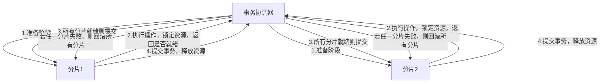
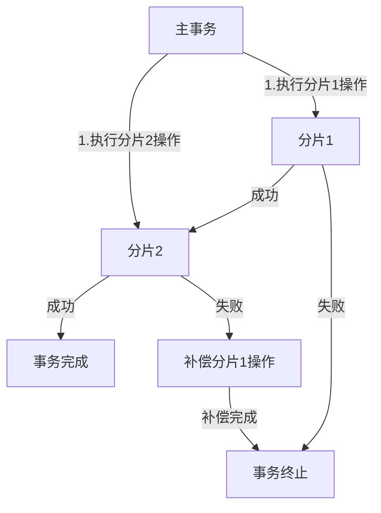
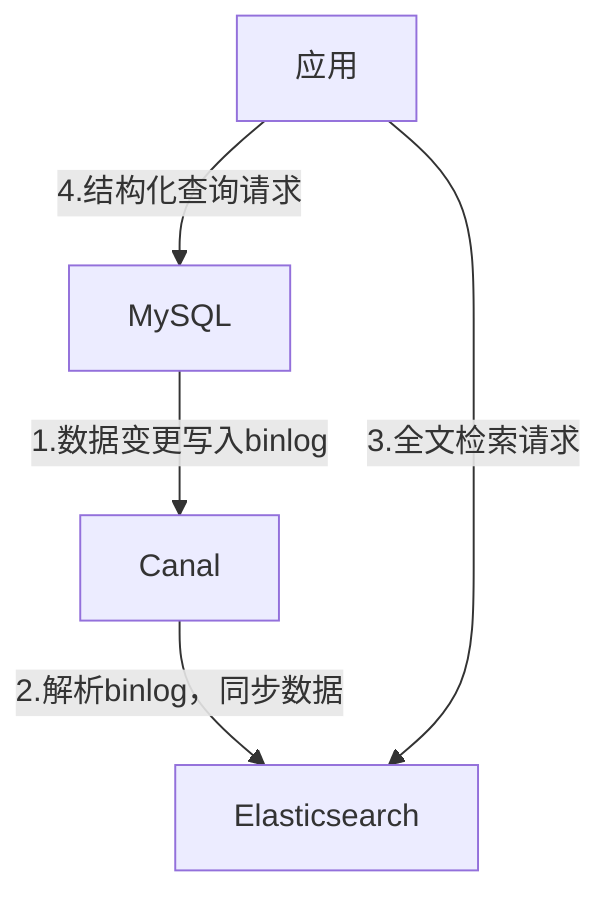

# MySQL 数据库应用指南：第16章 MySQL分布式与云原生应用

随着业务规模的增长，单库MySQL已无法满足海量数据存储、高并发访问的需求，分布式架构成为必然选择；而云原生技术的普及，又让MySQL的部署、运维模式发生了根本性变化。本章将从分布式核心概念、分片策略，到云原生部署、容器化实践，全面讲解MySQL在分布式与云原生场景下的应用方法，帮你适配从中小业务到海量数据的全场景需求。

## 16.1 分布式数据库的核心概念与挑战

### 16.1.1 分布式数据库核心概念

分布式数据库的本质是将数据分散存储在多个物理节点，通过统一的访问层对外提供服务，核心概念如下：
| 概念 | 定义 | 核心价值 |
|------|------|----------|
| **数据分片** | 将单表数据拆分到多个节点的不同表中 | 突破单库存储容量限制，分散读写压力 |
| **分库分表** | 分库：按业务拆分数据库；分表：按规则拆分单表 | 解决单库CPU/IO/连接数瓶颈 |
| **分布式事务** | 跨多个节点的事务，保证数据一致性 | 满足业务操作的原子性、一致性 |
| **读写分离** | 主库写、从库读，配合分片进一步分散压力 | 提升整体查询性能 |
| **全局ID** | 跨节点的唯一标识，替代自增ID | 避免分片后ID冲突 |
| **数据一致性** | 多节点数据的同步程度（强/最终一致） | 保障业务数据准确性 |

### 16.1.2 MySQL分布式架构的核心挑战

分布式架构虽解决了单库瓶颈，但也引入了新的复杂度，核心挑战包括：

1. **数据一致性**：跨节点事务难以保证ACID，尤其是高并发场景下的最终一致性；
2. **分片策略选型**：分片规则不合理会导致数据倾斜（某节点数据过多）、查询性能下降；
3. **跨分片查询**：多分片关联查询需聚合数据，性能和复杂度大幅提升；
4. **扩容难度**：分片规则确定后，扩容（如从4分片扩为8分片）需迁移数据，风险高；
5. **运维复杂度**：多节点监控、故障切换、备份恢复的难度远高于单库；
6. **事务性能**：分布式事务（如2PC）会引入额外开销，降低吞吐量。

### 16.1.3 分布式架构适用场景

并非所有业务都需要分布式架构，满足以下条件时才建议落地：

- 单表数据量＞1000万行，或单库数据量＞500GB；
- 单库QPS＞10000，或写TPS＞2000，单库已无法支撑；
- 业务增长快，短期内容量和并发会突破单库极限；
- 核心业务需7×24小时高可用，单库故障影响范围过大。

## 16.2 MySQL分片策略与实现方案

数据分片是分布式MySQL的核心，分片策略直接决定架构的性能和扩展性，需结合业务场景精准选择。

### 16.2.1 核心分片策略

#### 1. 水平分片（横向拆分）

将单表的行数据拆分到多个节点的同结构表中，是最常用的分片方式，核心规则如下：
| 分片规则 | 实现方式 | 适用场景 | 优点 | 缺点 |
|----------|----------|----------|------|------|
| **范围分片** | 按数值范围拆分（如按用户ID：1-100万→节点1，100-200万→节点2） | 数据有明显范围特征（如时间、ID） | 规则简单、扩容易规划 | 易数据倾斜（新数据集中在某节点） |
| **哈希分片** | 按字段哈希值取模（如user_id % 4 → 4个分片） | 数据分布均匀的场景（如用户、订单） | 数据分布均匀，查询性能稳定 | 扩容需重哈希，数据迁移量大 |
| **一致性哈希** | 哈希值映射到环形空间，节点对应环上位置 | 频繁扩容的场景 | 扩容仅迁移部分数据 | 实现复杂，易出现数据倾斜 |
| **业务分片** | 按业务属性拆分（如按地区：华东→节点1，华北→节点2） | 业务维度清晰的场景 | 贴合业务查询习惯 | 部分业务维度数据量过大 |

#### 2. 垂直分片（纵向拆分）

将单表的列数据拆分到不同表/库中（如用户表拆分为用户基本信息表、用户扩展信息表），适用于：

- 表字段过多（如100+字段），大部分查询仅需少数字段；
- 冷热数据分离（常用字段→高性能节点，冷门字段→普通节点）。

### 16.2.2 分片实现方案

MySQL分片需依赖中间件实现，主流方案对比：
| 方案 | 代表工具 | 核心特点 | 适用场景 |
|------|----------|----------|----------|
| **应用层分片** | Sharding-JDBC（Java）、Django-Sharding（Python） | 嵌入应用，无独立中间件，性能高 | 中小业务、开发语言统一的场景 |
| **代理层分片** | MyCat、ProxySQL、Sharding-Proxy | 独立代理层，支持多语言，适配性强 | 中大型业务、多语言架构 |
| **数据库层分片** | MySQL Fabric（官方） | 数据库原生支持，配置复杂 | 对原生兼容性要求高的场景 |

### 16.2.3 分片实战（Sharding-JDBC）

Sharding-JDBC是轻量级Java分片框架，嵌入应用层，无需独立部署，适合中小Java业务。

#### 1. 核心配置（application.yml）

```yaml
spring:
  shardingsphere:
    datasource:
      names: ds0,ds1 # 两个分片数据源
      ds0:
        type: com.zaxxer.hikari.HikariDataSource
        driver-class-name: com.mysql.cj.jdbc.Driver
        url: jdbc:mysql://192.168.1.100:3306/test_db?useSSL=false
        username: root
        password: Root@123456
      ds1:
        type: com.zaxxer.hikari.HikariDataSource
        driver-class-name: com.mysql.cj.jdbc.Driver
        url: jdbc:mysql://192.168.1.101:3306/test_db?useSSL=false
        username: root
        password: Root@123456
    rules:
      sharding:
        tables:
          t_order: # 订单表分片
            actual-data-nodes: ds${0..1}.t_order_${0..1} # 2库2表，共4分片
            database-strategy: # 分库规则：user_id取模
              standard:
                sharding-column: user_id
                sharding-algorithm-name: db_mod
            table-strategy: # 分表规则：order_id取模
              standard:
                sharding-column: order_id
                sharding-algorithm-name: table_mod
        sharding-algorithms:
          db_mod: # 分库算法：user_id % 2
            type: MOD
            props:
              sharding-count: 2
          table_mod: # 分表算法：order_id % 2
            type: MOD
            props:
              sharding-count: 2
    props:
      sql-show: true # 显示分片后的SQL
```

#### 2. 全局ID配置（解决ID冲突）

```yaml
spring:
  shardingsphere:
    rules:
      sharding:
        key-generators:
          snowflake: # 雪花算法生成全局ID
            type: SNOWFLAKE
            props:
              worker-id: 1 # 每个节点worker-id唯一
        tables:
          t_order:
            key-generate-strategy:
              column: order_id
              key-generator-name: snowflake
```

#### 3. 业务代码示例

```java
// 插入数据（自动路由到对应分片）
@Service
public class OrderService {
    @Autowired
    private OrderMapper orderMapper;

    public void createOrder(Order order) {
        // order_id由雪花算法自动生成，无需手动设置
        orderMapper.insert(order);
        // 底层实际执行：INSERT INTO ds1.t_order_0 (order_id, user_id, amount) VALUES (176890123456789, 1001, 99.9);
    }

    // 查询指定用户的订单（自动路由到对应分片）
    public List<Order> getOrderByUserId(Long userId) {
        return orderMapper.selectByUserId(userId);
    }
}
```

### 16.2.4 分片优化原则

1. **避免跨分片查询**：业务查询尽量基于分片键（如按user_id查询，而非按order_time）；
2. **控制分片粒度**：分片数不宜过多（建议8-32片），过多会增加聚合开销；
3. **数据倾斜治理**：定期监控各分片数据量，对倾斜分片拆分或迁移；
4. **预预留扩容空间**：初始分片数预留扩容空间（如预计扩容到16片，初始设8片）；
5. **冷热数据分离**：将半年前的冷数据迁移到低成本节点，降低核心节点压力。

## 16.3 分布式事务的解决方案（2PC、Saga）

分布式事务是跨多个分片的事务，核心目标是保证“要么全部成功，要么全部失败”，主流方案各有优劣，需结合业务场景选择。

### 16.3.1 2PC（两阶段提交）

2PC是分布式事务的经典方案，分为准备阶段和提交阶段，MySQL通过XA事务支持2PC。

#### 1. 2PC核心流程



#### 2. 2PC实战（XA事务）

```java
// Java中使用XA事务示例（基于JDBC）
public void distributedTransaction(Long userId, Long orderId) {
    // 获取XA连接
    XAConnection xaConn1 = ds1.getConnection().unwrap(XAConnection.class);
    XAConnection xaConn2 = ds2.getConnection().unwrap(XAConnection.class);

    // 创建事务分支
    Xid xid1 = new MyXid(1, "tx1".getBytes());
    Xid xid2 = new MyXid(2, "tx1".getBytes());

    // 准备阶段
    xaConn1.getXAResource().start(xid1, XAResource.TMNOFLAGS);
    executeSql(xaConn1.getConnection(), "UPDATE t_user SET balance = balance - 100 WHERE id = " + userId);
    xaConn1.getXAResource().end(xid1, XAResource.TMSUCCESS);

    xaConn2.getXAResource().start(xid2, XAResource.TMNOFLAGS);
    executeSql(xaConn2.getConnection(), "UPDATE t_order SET status = 1 WHERE id = " + orderId);
    xaConn2.getXAResource().end(xid2, XAResource.TMSUCCESS);

    // 提交阶段
    int prepare1 = xaConn1.getXAResource().prepare(xid1);
    int prepare2 = xaConn2.getXAResource().prepare(xid2);

    if (prepare1 == XAResource.XA_OK && prepare2 == XAResource.XA_OK) {
        // 所有分支就绪，提交
        xaConn1.getXAResource().commit(xid1, false);
        xaConn2.getXAResource().commit(xid2, false);
    } else {
        // 任一分支失败，回滚
        xaConn1.getXAResource().rollback(xid1);
        xaConn2.getXAResource().rollback(xid2);
    }
}
```

#### 3. 2PC优缺点

- **优点**：强一致性，符合ACID，实现简单；
- **缺点**：性能差（锁定资源时间长）、阻塞风险（协调器故障导致资源永久锁定）、可用性低（任一节点失败则事务失败）。

### 16.3.2 Saga模式（最终一致性）

Saga模式是基于补偿的分布式事务方案，放弃强一致性，追求最终一致性，适合高并发、高可用场景。

#### 1. Saga核心流程



#### 2. Saga实战（伪代码）

```java
// 订单创建+扣减库存的Saga事务
@Service
public class OrderSagaService {
    @Autowired
    private OrderMapper orderMapper;
    @Autowired
    private StockMapper stockMapper;

    @Transactional
    public void createOrderWithStock(Long userId, Long goodsId, Integer num) {
        // 步骤1：创建订单（分片1）
        Order order = new Order();
        order.setUserId(userId);
        order.setGoodsId(goodsId);
        order.setNum(num);
        Long orderId = orderMapper.insert(order);

        try {
            // 步骤2：扣减库存（分片2）
            int affectRows = stockMapper.deductStock(goodsId, num);
            if (affectRows == 0) {
                throw new RuntimeException("库存不足");
            }
        } catch (Exception e) {
            // 步骤3：补偿操作（回滚订单）
            orderMapper.delete(orderId);
            throw new RuntimeException("创建订单失败：" + e.getMessage());
        }
    }
}
```

#### 3. Saga优缺点

- **优点**：性能高（无锁定）、可用性高（单节点失败可补偿）、适配高并发；
- **缺点**：最终一致性（可能存在短暂数据不一致）、需编写补偿逻辑、复杂场景下补偿逻辑难以覆盖。

### 16.3.3 分布式事务方案选型

| 方案                      | 一致性              | 性能 | 适用场景                               |
| ------------------------- | ------------------- | ---- | -------------------------------------- |
| 2PC                       | 强一致              | 低   | 金融支付、核心账务（一致性优先）       |
| Saga                      | 最终一致            | 高   | 电商订单、库存管理（性能优先）         |
| TCC（Try-Confirm-Cancel） | 最终一致            | 中高 | 复杂业务场景（需自定义确认/取消逻辑）  |
| 本地消息表                | 最终一致            | 中   | 非实时场景（如消息通知、日志同步）     |
| Seata（阿里开源）         | 支持强一致/最终一致 | 中   | 中小业务快速落地（封装了2PC/TCC/Saga） |

## 16.4 云原生环境下MySQL的部署与管理

云原生的核心是“以应用为中心，基于容器、K8s实现自动化部署、弹性伸缩、故障自愈”，MySQL的云原生部署是企业上云的核心环节。

### 16.4.1 云原生MySQL的核心特征

1. **容器化部署**：MySQL运行在Docker容器中，环境隔离、部署标准化；
2. **K8s编排**：通过K8s StatefulSet管理MySQL集群，保证节点唯一性、数据持久化；
3. **弹性伸缩**：基于监控指标（CPU/内存/连接数）自动扩容从库；
4. **自愈能力**：节点故障时，K8s自动重启容器或调度到其他节点；
5. **存储分离**：使用K8s PV/PVC挂载云存储（如云盘、NFS），数据与容器解耦；
6. **配置管理**：通过ConfigMap/Secret管理MySQL配置和密码，无需修改镜像。

### 16.4.2 K8s部署MySQL单实例（基础版）

#### 1. 创建ConfigMap（配置文件）

```yaml
# mysql-config.yaml
apiVersion: v1
kind: ConfigMap
metadata:
  name: mysql-config
  namespace: mysql
data:
  my.cnf: |
    [mysqld]
    server_id = 100
    log_bin = /var/lib/mysql/mysql-bin
    binlog_format = ROW
    innodb_buffer_pool_size = 512M
    max_connections = 1000
    character-set-server = utf8mb4
    collation-server = utf8mb4_unicode_ci
```

#### 2. 创建Secret（密码）

```yaml
# mysql-secret.yaml
apiVersion: v1
kind: Secret
metadata:
  name: mysql-secret
  namespace: mysql
type: Opaque
data:
  root-password: Um9vdEAxMjM0NTY= # Base64编码的"Root@123456"
```

#### 3. 创建StatefulSet（MySQL实例）

```yaml
# mysql-statefulset.yaml
apiVersion: apps/v1
kind: StatefulSet
metadata:
  name: mysql
  namespace: mysql
spec:
  serviceName: mysql
  replicas: 1
  selector:
    matchLabels:
      app: mysql
  template:
    metadata:
      labels:
        app: mysql
    spec:
      containers:
        - name: mysql
          image: mysql:8.0
          ports:
            - containerPort: 3306
          env:
            - name: MYSQL_ROOT_PASSWORD
              valueFrom:
                secretKeyRef:
                  name: mysql-secret
                  key: root-password
            - name: MYSQL_DATABASE
              value: test_db
          volumeMounts:
            - name: mysql-config
              mountPath: /etc/mysql/conf.d
            - name: mysql-data
              mountPath: /var/lib/mysql
      volumes:
        - name: mysql-config
          configMap:
            name: mysql-config
  volumeClaimTemplates:
    - metadata:
        name: mysql-data
      spec:
        accessModes: ["ReadWriteOnce"]
        resources:
          requests:
            storage: 10Gi
```

#### 4. 创建Service（访问入口）

```yaml
# mysql-service.yaml
apiVersion: v1
kind: Service
metadata:
  name: mysql
  namespace: mysql
spec:
  selector:
    app: mysql
  ports:
    - port: 3306
      targetPort: 3306
  clusterIP: None # Headless Service，固定Pod名称
```

#### 5. 部署执行

```bash
# 创建命名空间
kubectl create namespace mysql

# 应用配置
kubectl apply -f mysql-config.yaml
kubectl apply -f mysql-secret.yaml
kubectl apply -f mysql-statefulset.yaml
kubectl apply -f mysql-service.yaml

# 查看部署状态
kubectl get pods -n mysql
kubectl logs -f mysql-0 -n mysql
```

### 16.4.3 云原生MySQL管理最佳实践

1. **数据持久化**：使用云厂商提供的持久化存储（如阿里云SSD云盘、AWS EBS），避免数据丢失；
2. **监控告警**：通过Prometheus + Grafana监控MySQL指标（CPU/内存/连接数/复制延迟），配置告警规则；
3. **备份策略**：使用K8s CronJob定期执行备份，备份文件存储到云对象存储（如S3/OSS）；
4. **升级策略**：采用蓝绿部署升级MySQL版本，先部署新版本实例，验证后切换流量；
5. **权限管理**：通过K8s RBAC限制MySQL Pod的访问权限，避免容器逃逸；
6. **高可用**：使用Operator（如Percona XtraDB Operator）部署MySQL集群，自动实现主从复制、故障切换。

## 16.5 MySQL与容器（Docker）的集成实践

Docker是云原生的基础，MySQL容器化能实现环境标准化、部署快速化，适合开发、测试、生产全环境。

### 16.5.1 Docker部署MySQL单实例

#### 1. 基础启动命令

```bash
# 简单启动（临时测试，数据不持久化）
docker run -d \
  --name mysql-test \
  -p 3306:3306 \
  -e MYSQL_ROOT_PASSWORD=Root@123456 \
  -e MYSQL_DATABASE=test_db \
  mysql:8.0

# 生产级启动（数据持久化、自定义配置）
# 1. 创建数据目录和配置文件
mkdir -p /docker/mysql/{data,conf}
cat > /docker/mysql/conf/my.cnf << EOF
[mysqld]
server_id = 100
log_bin = /var/lib/mysql/mysql-bin
innodb_buffer_pool_size = 1G
max_connections = 2000
EOF

# 2. 启动容器
docker run -d \
  --name mysql-prod \
  --restart=always \  # 开机自启
  -p 3306:3306 \
  -v /docker/mysql/conf:/etc/mysql/conf.d \
  -v /docker/mysql/data:/var/lib/mysql \
  -e MYSQL_ROOT_PASSWORD=Root@123456 \
  -e TZ=Asia/Shanghai \  # 时区配置
  mysql:8.0 --character-set-server=utf8mb4 --collation-server=utf8mb4_unicode_ci
```

#### 2. 容器内操作MySQL

```bash
# 进入容器
docker exec -it mysql-prod bash

# 登录MySQL
mysql -u root -pRoot@123456

# 备份容器内数据
docker exec mysql-prod mysqldump -u root -pRoot@123456 test_db > /docker/mysql/backup/test_db_$(date +%Y%m%d).sql

# 恢复数据到容器
docker cp /docker/mysql/backup/test_db_20260125.sql mysql-prod:/tmp/
docker exec mysql-prod mysql -u root -pRoot@123456 test_db < /tmp/test_db_20260125.sql
```

### 16.5.2 Docker Compose部署主从复制

Docker Compose可快速部署主从复制环境，适合开发测试。

#### 1. docker-compose.yml配置

```yaml
version: "3.8"
services:
  mysql-master:
    image: mysql:8.0
    container_name: mysql-master
    ports:
      - "3307:3306"
    volumes:
      - ./master/conf:/etc/mysql/conf.d
      - ./master/data:/var/lib/mysql
    environment:
      - MYSQL_ROOT_PASSWORD=Root@123456
      - TZ=Asia/Shanghai
    command: --server-id=100 --log-bin=mysql-bin --binlog-format=ROW

  mysql-slave:
    image: mysql:8.0
    container_name: mysql-slave
    ports:
      - "3308:3306"
    volumes:
      - ./slave/conf:/etc/mysql/conf.d
      - ./slave/data:/var/lib/mysql
    environment:
      - MYSQL_ROOT_PASSWORD=Root@123456
      - TZ=Asia/Shanghai
    command: --server-id=101 --relay-log=relay-bin --read-only=1
    depends_on:
      - mysql-master
```

#### 2. 启动并配置主从

```bash
# 启动容器
docker-compose up -d

# 主库创建复制账号
docker exec -it mysql-master mysql -u root -pRoot@123456 -e "
CREATE USER 'repl'@'%' IDENTIFIED BY 'Repl@123456';
GRANT REPLICATION SLAVE ON *.* TO 'repl'@'%';
FLUSH PRIVILEGES;
SHOW MASTER STATUS;"

# 从库配置复制（替换File和Position）
docker exec -it mysql-slave mysql -u root -pRoot@123456 -e "
CHANGE REPLICATION SOURCE TO
SOURCE_HOST='mysql-master',
SOURCE_USER='repl',
SOURCE_PASSWORD='Repl@123456',
SOURCE_LOG_FILE='mysql-bin.000001',
SOURCE_LOG_POS=156;
START SLAVE;
SHOW SLAVE STATUS\G;"
```

### 16.5.3 容器化MySQL注意事项

1. **数据持久化**：必须挂载数据目录到宿主机，否则容器删除后数据丢失；
2. **配置优化**：容器内MySQL配置需适配容器资源（内存/CPU），避免过度分配；
3. **性能调优**：禁用容器内存交换（--memory-swap=-1），提升IO性能；
4. **安全加固**：禁止映射3306端口到公网，设置强密码，限制访问IP；
5. **日志管理**：将MySQL日志挂载到宿主机，便于监控和排查问题。

## 16.6 MySQL在大数据场景下的应用拓展

MySQL虽不是专为大数据设计的数据库，但通过合理的架构设计和工具集成，可适配中小规模的大数据场景（如10TB以内）。

### 16.6.1 MySQL与大数据场景的适配方案

| 大数据场景       | 适配方案                                     | 核心价值                                  |
| ---------------- | -------------------------------------------- | ----------------------------------------- |
| **海量日志存储** | MySQL分库分表 + 按时间分片 + 冷数据归档      | 低成本存储，支持结构化查询                |
| **离线数据分析** | MySQL → DataX → Hive/ClickHouse              | 利用大数据引擎做聚合分析，不影响MySQL性能 |
| **实时数据统计** | MySQL binlog → Canal → Kafka → Flink → MySQL | 实时计算统计结果，写入汇总表              |
| **全文检索**     | MySQL + Elasticsearch（ES）                  | ES做全文检索，MySQL存储结构化数据         |

### 16.6.2 MySQL与Elasticsearch集成（全文检索）

#### 1. 核心流程



#### 2. 实战配置（Canal同步MySQL到ES）

```xml
<!-- canal配置文件 instance.properties -->
canal.instance.master.address=192.168.1.100:3306
canal.instance.dbUsername=canal
canal.instance.dbPassword=Canal@123456
canal.instance.defaultDatabaseName=test_db
canal.instance.filter.regex=test_db.t_article  # 同步文章表

<!-- canal同步到ES的适配器配置 -->
canal.adapter.es.hosts=192.168.1.200:9200
canal.adapter.es.index=t_article
canal.adapter.es.id=id
canal.adapter.es.fields=id,title,content,create_time
```

#### 3. 应用查询示例

```java
// 全文检索文章标题
public List<Article> searchArticle(String keyword) {
    // 1. ES全文检索获取ID列表
    List<Long> idList = esClient.search("t_article",
        QueryBuilders.matchQuery("title", keyword)).getIds();

    // 2. MySQL批量查询结构化数据
    return articleMapper.selectBatchIds(idList);
}
```

### 16.6.3 MySQL与大数据引擎集成（离线分析）

#### 1. DataX同步MySQL到Hive

```json
// job.json配置
{
  "job": {
    "content": [
      {
        "reader": {
          "name": "mysqlreader",
          "parameter": {
            "username": "root",
            "password": "Root@123456",
            "column": ["id", "user_id", "order_id", "amount", "create_time"],
            "connection": [
              {
                "table": ["t_order"],
                "jdbcUrl": ["jdbc:mysql://192.168.1.100:3306/test_db"]
              }
            ]
          }
        },
        "writer": {
          "name": "hdfswriter",
          "parameter": {
            "path": "/user/hive/warehouse/test_db.db/t_order",
            "defaultFS": "hdfs://192.168.1.150:9000",
            "fileType": "orc",
            "column": [
              { "index": 0, "type": "bigint" },
              { "index": 1, "type": "bigint" },
              { "index": 2, "type": "bigint" },
              { "index": 3, "type": "double" },
              { "index": 4, "type": "string" }
            ],
            "writeMode": "append"
          }
        }
      }
    ],
    "setting": {
      "speed": {
        "channel": 5
      }
    }
  }
}
```

#### 2. 执行同步

```bash
python datax.py job.json
```

### 16.6.4 大数据场景下MySQL优化原则

1. **读写分离**：分析查询仅访问从库，避免影响主库业务；
2. **数据分层**：原始数据→汇总数据→统计数据，不同层级存储在不同表/库；
3. **避免大查询**：禁止在MySQL执行全表扫描、复杂聚合，移至大数据引擎；
4. **归档冷数据**：将超过6个月的冷数据归档到低成本存储（如HDFS），仅保留热点数据；
5. **索引优化**：仅保留业务查询必需的索引，减少写入开销。

### 总结

1. 分布式MySQL的核心是数据分片，需结合业务选择范围/哈希分片，优先使用Sharding-JDBC/MyCat等成熟中间件；
2. 分布式事务需平衡一致性与性能，金融场景用2PC，高并发场景用Saga/TCC；
3. 云原生MySQL推荐基于K8s StatefulSet部署，结合ConfigMap/Secret管理配置，使用PV/PVC保证数据持久化；
4. Docker化MySQL需重点关注数据持久化和配置优化，适合快速部署和环境标准化；
5. 大数据场景下，MySQL可与ES/Flink/Hive集成，各司其职（MySQL存结构化数据，大数据引擎做检索/分析）。

MySQL的分布式与云原生改造，核心是“适配业务增长”——无需追求一步到位，可从读写分离→分表→分库→分布式集群逐步演进，始终以业务需求为导向，平衡性能、一致性和运维成本。
