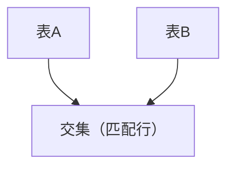
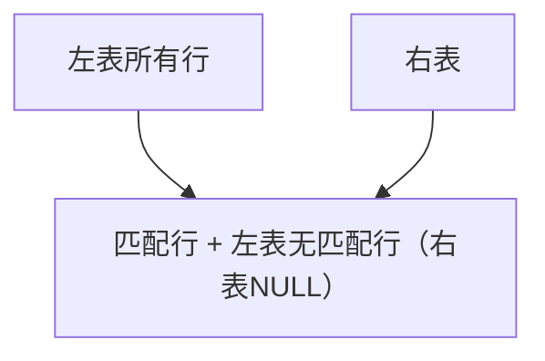

# MySQL 数据库应用指南：第5章 高级查询与多表关联

在前一章掌握基础查询后，本章将进入 MySQL 查询的核心进阶环节——高级查询与多表关联。实际业务中，数据往往分散在多个数据表中（比如“学生表”和“成绩表”、“订单表”和“用户表”），单纯的单表查询无法满足需求。本章将讲解聚合函数、分组查询、多表连接、子查询等核心知识点，帮你实现复杂场景下的数据提取与分析。

## 5.1 聚合函数（SUM/AVG/COUNT等）的使用

聚合函数（Aggregate Function）用于对一组数据进行计算并返回单个结果，是数据分析的基础工具。MySQL 提供了常用的聚合函数，可直接作用于字段或查询结果集。

### 5.1.1 常用聚合函数汇总

| 函数名            | 作用             | 注意事项                                                    |
| ----------------- | ---------------- | ----------------------------------------------------------- |
| `SUM(字段名)`     | 计算字段的总和   | 仅对数值类型有效，NULL 值会被忽略                           |
| `AVG(字段名)`     | 计算字段的平均值 | 仅对数值类型有效，NULL 值会被忽略                           |
| `COUNT(字段名/*)` | 统计行数         | `COUNT(*)` 统计所有行（含NULL），`COUNT(字段)` 统计非NULL行 |
| `MAX(字段名)`     | 取字段的最大值   | 支持数值、字符串、日期类型                                  |
| `MIN(字段名)`     | 取字段的最小值   | 支持数值、字符串、日期类型                                  |

### 5.1.2 聚合函数使用示例

为了演示，先创建并插入测试数据（后续示例均基于这两张表）：

```sql
-- 1. 学生表（沿用第4章结构，补充数据）
CREATE TABLE IF NOT EXISTS student (
  id INT PRIMARY KEY AUTO_INCREMENT,
  name VARCHAR(50) NOT NULL,
  gender CHAR(1),
  age INT,
  class_id INT  -- 关联班级表的主键
) CHARSET=utf8mb4;

INSERT INTO student (name, gender, age, class_id) VALUES
('张三', '男', 18, 1),
('李四', '女', 17, 1),
('王五', '男', 18, 2),
('赵六', '女', 17, 2),
('钱七', '男', 19, 1),
('孙八', '女', 18, 2);

-- 2. 成绩表
CREATE TABLE IF NOT EXISTS score (
  id INT PRIMARY KEY AUTO_INCREMENT,
  student_id INT,  -- 关联学生表的主键
  subject VARCHAR(20),  -- 科目
  score FLOAT  -- 分数
) CHARSET=utf8mb4;

INSERT INTO score (student_id, subject, score) VALUES
(1, '数学', 90.5),
(1, '语文', 85.0),
(2, '数学', 88.0),
(2, '语文', 92.5),
(3, '数学', 78.0),
(3, '语文', 80.5),
(4, '数学', 95.0),
(4, '语文', 89.0),
(5, '数学', NULL),  -- 缺考
(5, '语文', 75.0);
```

#### 示例1：SUM/AVG 计算总和与平均值

```sql
-- 计算所有学生的数学总分
SELECT SUM(score) AS 数学总分 FROM score WHERE subject = '数学';

-- 计算所有学生的语文平均分（自动忽略NULL值）
SELECT AVG(score) AS 语文平均分 FROM score WHERE subject = '语文';
```

#### 示例2：COUNT 统计行数

```sql
-- 统计学生总数（COUNT(*) 包含所有行）
SELECT COUNT(*) AS 学生总数 FROM student;

-- 统计有数学成绩的学生数（排除NULL）
SELECT COUNT(score) AS 数学参考人数 FROM score WHERE subject = '数学';

-- 统计不同性别的学生数（后续结合GROUP BY更高效）
SELECT COUNT(*) AS 男生数 FROM student WHERE gender = '男';
```

#### 示例3：MAX/MIN 取最值

```sql
-- 取数学最高分
SELECT MAX(score) AS 数学最高分 FROM score WHERE subject = '数学';

-- 取语文最低分
SELECT MIN(score) AS 语文最低分 FROM score WHERE subject = '语文';
```

### 5.1.3 聚合函数的常见坑

1. **NULL 值处理**：所有聚合函数（除 `COUNT(*)`）都会忽略 NULL 值，若需包含 NULL，可先用 `IFNULL` 替换：
   ```sql
   -- 计算钱七的数学成绩（NULL替换为0）
   SELECT AVG(IFNULL(score, 0)) AS 数学平均分 FROM score WHERE subject = '数学';
   ```
2. **聚合函数与普通字段混用**：默认情况下，聚合函数不能和非聚合字段直接混用（需结合 GROUP BY），否则会报错或返回非预期结果。

## 5.2 分组查询（GROUP BY）与筛选分组（HAVING）

聚合函数默认对整个结果集计算，而 `GROUP BY` 可将数据按指定字段分组，再对每组分别计算；`HAVING` 则用于筛选分组后的结果（类似 WHERE，但作用于分组）。

### 5.2.1 GROUP BY 语法与示例

#### 基础语法：

```sql
SELECT 分组字段, 聚合函数(字段名)
FROM 表名
[WHERE 筛选条件]
GROUP BY 分组字段;
```

#### 示例1：按班级分组统计学生数

```sql
-- 按class_id分组，统计每个班级的学生数
SELECT class_id AS 班级ID, COUNT(*) AS 学生数
FROM student
GROUP BY class_id;

-- 执行结果：
+--------+--------+
| 班级ID | 学生数 |
+--------+--------+
|      1 |      3 |
|      2 |      3 |
+--------+--------+
```

#### 示例2：按科目分组计算平均分

```sql
-- 按科目分组，计算每科的平均分（忽略NULL）
SELECT subject AS 科目, AVG(score) AS 平均分
FROM score
GROUP BY subject;
```

#### 示例3：多字段分组

```sql
-- 按学生ID+科目分组（实际无意义，仅演示多字段）
SELECT student_id, subject, MAX(score)
FROM score
GROUP BY student_id, subject;
```

### 5.2.2 HAVING 筛选分组结果

`WHERE` 筛选**分组前**的行，`HAVING` 筛选**分组后**的结果，语法：

```sql
SELECT 分组字段, 聚合函数(字段名)
FROM 表名
WHERE 筛选条件
GROUP BY 分组字段
HAVING 聚合函数条件;
```

#### 示例：筛选平均分大于85的科目

```sql
-- 先按科目分组计算平均分，再筛选平均分>85的科目
SELECT subject AS 科目, AVG(score) AS 平均分
FROM score
GROUP BY subject
HAVING AVG(score) > 85;

-- 执行结果：
+--------+--------+
| 科目   | 平均分 |
+--------+--------+
| 数学   | 87.875 |
| 语文   | 84.4？（需计算，若不足则不显示） |
+--------+--------+
```

### 5.2.3 GROUP BY 与 HAVING 的核心区别

| 关键字 | 作用阶段 | 能否使用聚合函数 | 筛选对象 |
| ------ | -------- | ---------------- | -------- |
| WHERE  | 分组前   | 不能             | 单行数据 |
| HAVING | 分组后   | 能               | 分组结果 |

## 5.3 内连接（INNER JOIN）的原理与实践

多表关联的核心是“连接（JOIN）”，内连接（INNER JOIN）是最常用的连接方式，只返回两张表中**匹配条件**的行（即交集）。

### 5.3.1 内连接原理

内连接基于“连接条件”匹配两张表的数据，只保留满足条件的行，示意图如下（交集部分）：



#### 基础语法：

```sql
-- 显式内连接（推荐，可读性高）
SELECT 字段名
FROM 表1
INNER JOIN 表2
ON 表1.关联字段 = 表2.关联字段
[WHERE 筛选条件];

-- 隐式内连接（不推荐，易混淆）
SELECT 字段名
FROM 表1, 表2
WHERE 表1.关联字段 = 表2.关联字段;
```

### 5.3.2 内连接实战示例

#### 示例1：查询学生姓名及对应的数学成绩

```sql
-- 关联student和score表，查询数学成绩（只返回有成绩的学生）
SELECT s.name AS 姓名, sc.score AS 数学成绩
FROM student s  -- 给表起别名，简化代码
INNER JOIN score sc
ON s.id = sc.student_id
WHERE sc.subject = '数学';

-- 执行结果（钱七因数学成绩NULL，不会出现在结果中）：
+--------+----------+
| 姓名   | 数学成绩 |
+--------+----------+
| 张三   |     90.5 |
| 李四   |     88.0 |
| 王五   |     78.0 |
| 赵六   |     95.0 |
+--------+----------+
```

#### 示例2：多表内连接（扩展）

若新增“班级表”，可关联三张表：

```sql
-- 创建班级表
CREATE TABLE class (
  id INT PRIMARY KEY,
  class_name VARCHAR(20)
);
INSERT INTO class VALUES (1, '高一(1)班'), (2, '高一(2)班');

-- 关联三张表，查询学生姓名、班级、数学成绩
SELECT s.name, c.class_name, sc.score
FROM student s
INNER JOIN class c ON s.class_id = c.id
INNER JOIN score sc ON s.id = sc.student_id
WHERE sc.subject = '数学';
```

## 5.4 外连接（LEFT/RIGHT JOIN）的应用场景

内连接只返回匹配行，而外连接会保留一张表的所有行，另一张表无匹配时用 NULL 填充。外连接分为左外连接（LEFT JOIN）和右外连接（RIGHT JOIN），其中 LEFT JOIN 更常用。

### 5.4.1 左外连接（LEFT JOIN）

#### 原理：

保留左表的所有行，右表无匹配时，右表字段返回 NULL，示意图：



#### 语法：

```sql
SELECT 字段名
FROM 左表
LEFT JOIN 右表
ON 连接条件
[WHERE 筛选条件];
```

#### 示例：查询所有学生的数学成绩（含缺考）

```sql
-- 左连接保留所有学生，即使无数学成绩
SELECT s.name AS 姓名, IFNULL(sc.score, '缺考') AS 数学成绩
FROM student s
LEFT JOIN score sc
ON s.id = sc.student_id AND sc.subject = '数学';  -- 连接条件包含科目，避免WHERE过滤

-- 执行结果（钱七会显示“缺考”）：
+--------+----------+
| 姓名   | 数学成绩 |
+--------+----------+
| 张三   |     90.5 |
| 李四   |     88.0 |
| 王五   |     78.0 |
| 赵六   |     95.0 |
| 钱七   | 缺考     |
| 孙八   | 缺考     |
+--------+----------+
```

### 5.4.2 右外连接（RIGHT JOIN）

#### 原理：

保留右表的所有行，左表无匹配时返回 NULL，语法只需将 LEFT JOIN 改为 RIGHT JOIN，实际场景中可通过调换表顺序用 LEFT JOIN 替代，示例：

```sql
-- 右连接（等价于将student和score调换后的左连接）
SELECT s.name, sc.score
FROM score sc
RIGHT JOIN student s
ON sc.student_id = s.id
WHERE sc.subject = '数学';
```

### 5.4.3 外连接的典型应用场景

1. **查询“有/无”关联数据**：比如“查询所有用户及对应的订单（含无订单的用户）”；
2. **数据补全**：比如“统计所有班级的平均分，含无学生的班级”；
3. **对比数据**：比如“查询有成绩但无学生信息的异常数据”（右连接+左表NULL）。

## 5.5 子查询（相关子查询与非相关子查询）

子查询（Subquery）是嵌套在主查询中的查询语句，可将一个查询的结果作为另一个查询的条件或数据源。根据是否依赖主查询，分为**非相关子查询**和**相关子查询**。

### 5.5.1 非相关子查询（独立子查询）

子查询可独立执行，结果作为主查询的条件，常用 `IN`/`NOT IN`/`=`/`>` 等运算符。

#### 示例1：查询数学成绩大于平均分的学生

```sql
-- 步骤1：先查数学平均分（子查询）
SELECT AVG(score) FROM score WHERE subject = '数学';  -- 结果约87.875

-- 步骤2：主查询用子查询结果作为条件
SELECT s.name, sc.score
FROM student s
INNER JOIN score sc ON s.id = sc.student_id
WHERE sc.subject = '数学' AND sc.score > (SELECT AVG(score) FROM score WHERE subject = '数学');

-- 执行结果（张三、赵六的成绩大于平均分）：
+--------+-------+
| 姓名   | score |
+--------+-------+
| 张三   |  90.5 |
| 赵六   |  95.0 |
+--------+-------+
```

#### 示例2：用 IN 子查询筛选

```sql
-- 查询高一(1)班的学生的语文成绩
SELECT s.name, sc.score
FROM student s
INNER JOIN score sc ON s.id = sc.student_id
WHERE sc.subject = '语文' AND s.class_id IN (SELECT id FROM class WHERE class_name = '高一(1)班');
```

### 5.5.2 相关子查询（依赖子查询）

子查询依赖主查询的字段，需逐行执行（效率较低），常用 `EXISTS`/`NOT EXISTS` 或 `=` 运算符。

#### 示例1：查询有成绩的学生

```sql
-- 相关子查询：判断每个学生是否有成绩
SELECT name
FROM student s
WHERE EXISTS (SELECT 1 FROM score sc WHERE sc.student_id = s.id);
```

#### 示例2：查询每个学生的最高成绩

```sql
-- 相关子查询：对每个学生，查其最高分
SELECT s.name,
       (SELECT MAX(score) FROM score sc WHERE sc.student_id = s.id) AS 最高分
FROM student s;
```

### 5.5.3 子查询的注意事项

1. **性能**：相关子查询逐行执行，数据量大时效率低，优先用 JOIN 替代；
2. **括号**：子查询必须用括号包裹；
3. **EXISTS 优化**：`EXISTS` 只需判断是否存在，无需返回数据，常用 `SELECT 1` 代替 `SELECT *` 提升效率。

## 5.6 多表查询的优化思路与常见问题

多表查询是性能问题的高发区，新手易因写法不当导致查询缓慢。本节总结核心优化思路和常见坑，帮你写出高效的多表查询。

### 5.6.1 核心优化思路

#### 1. 给关联字段加索引

多表连接的核心是关联字段（如 student.id、score.student_id），给这些字段加索引可大幅提升连接效率：

```sql
-- 给score表的student_id加索引
ALTER TABLE score ADD INDEX idx_student_id (student_id);
```

#### 2. 优先过滤再连接

先通过 WHERE 筛选出少量数据，再进行连接，避免全表连接：

```sql
-- 低效：先连接全表，再筛选
SELECT s.name, sc.score
FROM student s
LEFT JOIN score sc ON s.id = sc.student_id
WHERE sc.subject = '数学';

-- 高效：先筛选score表，再连接
SELECT s.name, sc.score
FROM student s
LEFT JOIN (SELECT * FROM score WHERE subject = '数学') sc ON s.id = sc.student_id;
```

#### 3. 避免笛卡尔积

忘记写连接条件会导致笛卡尔积（两张表行数相乘），数据量大时直接卡死：

```sql
-- 错误：无ON条件，返回 6*10=60 行（student6行，score10行）
SELECT s.name, sc.score FROM student s INNER JOIN score sc;

-- 正确：必须加ON连接条件
SELECT s.name, sc.score FROM student s INNER JOIN score sc ON s.id = sc.student_id;
```

#### 4. 合理使用表别名

多表查询时，给表起简短别名（如 s 代表 student），简化代码且提升可读性。

#### 5. 限制返回字段

避免 `SELECT *`，只查询需要的字段，减少网络传输和IO开销。

### 5.6.2 常见问题与排查

#### 问题1：连接后结果重复

- 原因：关联字段不唯一（比如一个学生有多条成绩记录）；
- 解决：用 `DISTINCT` 去重，或调整分组逻辑：
  ```sql
  -- 去重查询学生姓名（避免重复）
  SELECT DISTINCT s.name FROM student s INNER JOIN score sc ON s.id = sc.student_id;
  ```

#### 问题2：外连接后 WHERE 过滤导致左表数据丢失

- 原因：WHERE 子句过滤了右表 NULL 值，等价于内连接；
- 示例（错误）：
  ```sql
  -- 意图查询所有学生的数学成绩，但WHERE过滤了NULL，只剩有成绩的学生
  SELECT s.name, sc.score
  FROM student s
  LEFT JOIN score sc ON s.id = sc.student_id
  WHERE sc.subject = '数学';
  ```
- 解决：将条件移到 ON 子句中：
  ```sql
  SELECT s.name, sc.score
  FROM student s
  LEFT JOIN score sc ON s.id = sc.student_id AND sc.subject = '数学';
  ```

#### 问题3：子查询效率低

- 原因：相关子查询逐行执行，数据量大时耗时；
- 解决：用 JOIN 替代子查询：

  ```sql
  -- 子查询（低效）
  SELECT name FROM student WHERE id IN (SELECT student_id FROM score WHERE score > 90);

  -- JOIN替代（高效）
  SELECT DISTINCT s.name FROM student s INNER JOIN score sc ON s.id = sc.student_id WHERE sc.score > 90;
  ```

### 总结

1. 聚合函数（SUM/AVG/COUNT等）用于数据分析，需注意 NULL 值处理，`COUNT(*)` 统计所有行，`COUNT(字段)` 只统计非NULL行；
2. GROUP BY 按字段分组计算聚合值，HAVING 筛选分组结果（区别于 WHERE 筛选单行）；
3. 内连接（INNER JOIN）返回匹配行，左外连接（LEFT JOIN）保留左表所有行（无匹配则右表NULL），是多表查询的核心；
4. 子查询分为非相关（独立执行）和相关（依赖主查询），优先用 JOIN 替代相关子查询提升效率；
5. 多表查询优化核心：给关联字段加索引、优先过滤再连接、避免笛卡尔积、限制返回字段。

本章的多表关联和高级查询是 MySQL 实战的核心，建议结合业务场景多练习（比如“统计每个班级的各科平均分”“查询缺考学生名单”），熟练掌握后就能应对大部分日常数据查询需求。下一章将讲解数据的增删改操作，完成从“查”到“改”的全流程掌握。
